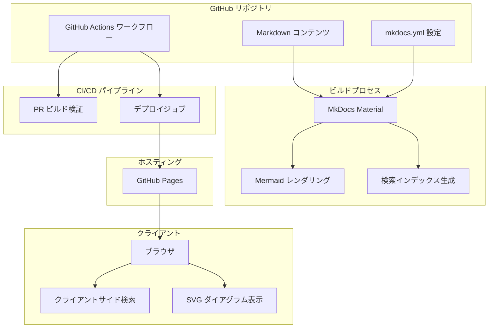
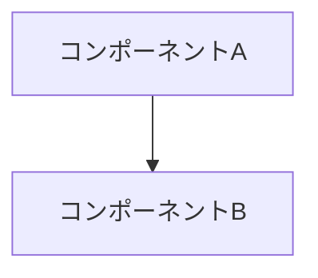
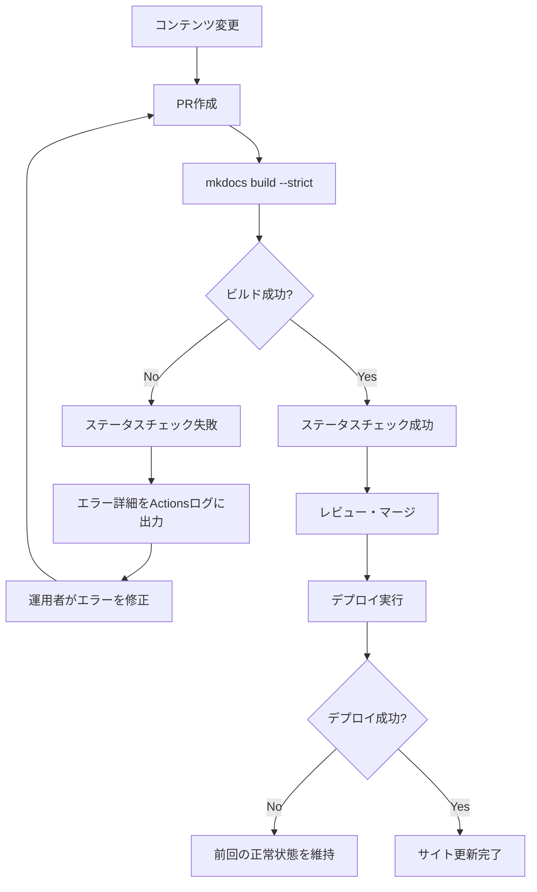

# 設計ドキュメント: HPC インフラドキュメントサイト

## 概要

本設計ドキュメントは、HPCシステムのインフラ構成を「機能・サービス視点」で可視化するドキュメントサイトの技術設計を定義する。MkDocs Materialをベースとした静的サイト生成、GitHub Actionsによる自動デプロイ、Mermaid構成図のレンダリング、クライアントサイド検索を実現する。

### SSGエンジン選定: MkDocs Material

MkDocs Materialを採用する理由:

- Markdownネイティブ対応で運用者が容易に編集可能
- Mermaidダイアグラムのビルトインサポート（`pymdownx.superfences`カスタムフェンス）
- クライアントサイド全文検索が標準搭載（lunr.jsベース、日本語対応プラグインあり）
- レスポンシブデザイン標準対応
- パンくずリスト、サイドバーナビゲーション、ページ内目次が標準機能
- GitHub Pagesデプロイが`mkdocs gh-deploy`コマンドで完結
- Python/pipベースで環境構築が容易
- 豊富なプラグインエコシステム

## アーキテクチャ

### システム構成図



### 技術スタック

| コンポーネント | 技術 | バージョン |
|---|---|---|
| SSGエンジン | MkDocs Material | 9.x |
| ダイアグラム | Mermaid（pymdownx.superfencesカスタムフェンス） | ビルトイン |
| 検索 | MkDocs内蔵検索（lunr.js + 日本語プラグイン） | ビルトイン |
| CI/CD | GitHub Actions | v4 |
| ホスティング | GitHub Pages | - |
| パッケージ管理 | pip + requirements.txt | - |


## コンポーネントとインターフェース

### 1. ディレクトリ構造

```
hpc-infra-docs/
├── .github/
│   └── workflows/
│       ├── ci.yml              # PR ビルド検証ワークフロー
│       └── deploy.yml          # デプロイワークフロー
├── docs/
│   ├── index.md                # トップページ
│   ├── user-access/            # ユーザーアクセス・認証・ポータル
│   │   ├── index.md
│   │   ├── registration-flow.md
│   │   ├── user-db.md
│   │   ├── hr-sync.md
│   │   ├── account-audit.md
│   │   ├── admin-privileges.md
│   │   ├── uid-gid-policy.md
│   │   ├── account-lifecycle.md
│   │   ├── ldap-ad.md
│   │   └── portal.md
│   ├── compute/                # 計算リソース・ジョブ管理
│   │   ├── index.md
│   │   ├── node-types.md
│   │   ├── virtual-infra.md
│   │   ├── queue-design.md
│   │   ├── scheduler.md
│   │   └── container.md
│   ├── applications/           # アプリケーション・ライセンス
│   │   ├── index.md
│   │   ├── cae-software.md
│   │   ├── license-server.md
│   │   └── github-server.md
│   ├── data-ops/               # データ管理・基盤サービス・運用管理
│   │   ├── index.md
│   │   ├── shared-storage.md
│   │   ├── nas-gw.md
│   │   ├── dns-ntp.md
│   │   ├── monitoring.md
│   │   ├── backup.md
│   │   └── billing.md
│   ├── network/                # ネットワーク
│   │   ├── index.md
│   │   ├── logical-design.md
│   │   ├── vlan-subnet.md
│   │   └── ip-management.md
│   ├── manuals/                # マニュアル・チュートリアル
│   │   └── index.md
│   ├── faq/                    # FAQ
│   │   └── index.md
│   └── status/                 # 稼働状況
│       └── index.md
├── mkdocs.yml                  # MkDocs 設定ファイル
├── requirements.txt            # Python 依存パッケージ
└── README.md
```

### 2. MkDocs設定ファイル（mkdocs.yml）

```yaml
site_name: HPC インフラ構成ドキュメント
site_url: https://<org>.github.io/hpc-infra-docs/
theme:
  name: material
  language: ja
  features:
    - navigation.tabs
    - navigation.sections
    - navigation.expand
    - navigation.path          # パンくずリスト
    - navigation.indexes       # カテゴリindexページ
    - search.suggest
    - search.highlight
    - content.code.copy
  palette:
    - scheme: default
      primary: indigo
      accent: indigo

plugins:
  - search:
      lang:
        - ja
        - en

markdown_extensions:
  - pymdownx.superfences:
      custom_fences:
        - name: mermaid
          class: mermaid
          format: !!python/name:pymdownx.superfences.fence_mermaid
  - pymdownx.tabbed:
      alternate_style: true
  - admonition
  - pymdownx.details
  - attr_list
  - toc:
      permalink: true

nav:
  - ホーム: index.md
  - ユーザーアクセス・認証・ポータル:
    - user-access/index.md
    - ユーザー登録フロー: user-access/registration-flow.md
    - ユーザー管理DB: user-access/user-db.md
    - 人事連携: user-access/hr-sync.md
    - アカウント棚卸: user-access/account-audit.md
    - 管理者権限: user-access/admin-privileges.md
    - UID/GIDポリシー: user-access/uid-gid-policy.md
    - アカウントライフサイクル: user-access/account-lifecycle.md
    - LDAP/AD構成: user-access/ldap-ad.md
    - 利用ポータル: user-access/portal.md
  - 計算リソース・ジョブ管理:
    - compute/index.md
    - ノードタイプ: compute/node-types.md
    - 仮想基盤: compute/virtual-infra.md
    - キュー設計: compute/queue-design.md
    - ジョブスケジューラ: compute/scheduler.md
    - コンテナ: compute/container.md
  - アプリケーション・ライセンス:
    - applications/index.md
    - CAEソフトウェア: applications/cae-software.md
    - ライセンスサーバ: applications/license-server.md
    - GitHub Server: applications/github-server.md
  - データ管理・基盤サービス・運用管理:
    - data-ops/index.md
    - 共有ストレージ: data-ops/shared-storage.md
    - ファイル共有: data-ops/nas-gw.md
    - DNS/NTP: data-ops/dns-ntp.md
    - 監視: data-ops/monitoring.md
    - バックアップ: data-ops/backup.md
    - 課金・統計: data-ops/billing.md
  - ネットワーク:
    - network/index.md
    - 論理構成: network/logical-design.md
    - VLAN/サブネット: network/vlan-subnet.md
    - IPアドレス管理: network/ip-management.md
  - マニュアル: manuals/index.md
  - FAQ: faq/index.md
  - 稼働状況: status/index.md
```

### 3. GitHub Actionsワークフロー設計

#### 3.1 PRビルド検証ワークフロー（ci.yml）

```yaml
name: Build Check
on:
  pull_request:
    branches: [main]
    paths:
      - 'docs/**'
      - 'mkdocs.yml'
      - 'requirements.txt'

jobs:
  build:
    runs-on: ubuntu-latest
    steps:
      - uses: actions/checkout@v4
      - uses: actions/setup-python@v5
        with:
          python-version: '3.12'
      - run: pip install -r requirements.txt
      - run: mkdocs build --strict
```

- `--strict`フラグにより、警告もエラーとして扱いビルド失敗を報告
- PRのステータスチェックとして結果が自動表示される

#### 3.2 デプロイワークフロー（deploy.yml）

```yaml
name: Deploy
on:
  push:
    branches: [main]
    paths:
      - 'docs/**'
      - 'mkdocs.yml'
      - 'requirements.txt'

permissions:
  pages: write
  id-token: write

jobs:
  deploy:
    runs-on: ubuntu-latest
    environment:
      name: github-pages
      url: ${{ steps.deployment.outputs.page_url }}
    steps:
      - uses: actions/checkout@v4
      - uses: actions/setup-python@v5
        with:
          python-version: '3.12'
      - run: pip install -r requirements.txt
      - run: mkdocs build --strict
      - uses: actions/upload-pages-artifact@v3
        with:
          path: site/
      - id: deployment
        uses: actions/deploy-pages@v4
```

- GitHub Pagesの公式デプロイアクションを使用
- デプロイ失敗時はGitHub Pagesが前回の正常デプロイ状態を維持（アーティファクトが更新されないため）

### 4. 検索機能

MkDocs Material内蔵の検索機能を使用する:

- ビルド時にlunr.jsベースの検索インデックス（`search_index.json`）を自動生成
- `search`プラグインの`lang: ja`設定で日本語トークナイザーを有効化
- クライアントサイドで動作し、外部サービス依存なし
- 検索結果にページタイトルと該当箇所の抜粋を表示
- `search.suggest`でインクリメンタルサジェスト、`search.highlight`で検索語ハイライトを有効化

### 5. Mermaid統合

`pymdownx.superfences`のカスタムフェンス機能でMermaidを統合する:

- Markdownファイル内に` ```mermaid `コードブロックとして記述
- MkDocs MaterialがビルトインのMermaid.js統合でSVGにレンダリング
- 構文エラー時はMermaid.jsがエラーメッセージを該当箇所に表示

### 6. コンテンツファイルテンプレート

各コンテンツページは以下のMarkdownテンプレートに従う:

```markdown
---
title: ページタイトル
description: ページの概要説明
---

# ページタイトル

## 概要

このページの目的と対象範囲の説明。

## 構成

### サブセクション

詳細な構成情報。

## 構成図

（該当する場合）



## 運用手順

関連する運用手順の記述。

## 関連ページ

- [関連ページ1](../path/to/page.md)
- [関連ページ2](../path/to/page.md)
```

### 7. ナビゲーション構造

```mermaid
graph TD
    HOME["ホーム"]
    HOME --> UA["ユーザーアクセス・認証・ポータル"]
    HOME --> CR["計算リソース・ジョブ管理"]
    HOME --> APP["アプリケーション・ライセンス"]
    HOME --> DO["データ管理・基盤サービス・運用管理"]
    HOME --> NW["ネットワーク"]
    HOME --> MAN["マニュアル"]
    HOME --> FAQ["FAQ"]
    HOME --> ST["稼働状況"]

    UA --> UA1["ユーザー登録フロー"]
    UA --> UA2["ユーザー管理DB"]
    UA --> UA3["人事連携"]
    UA --> UA4["アカウント棚卸"]
    UA --> UA5["管理者権限"]
    UA --> UA6["UID/GIDポリシー"]
    UA --> UA7["アカウントライフサイクル"]
    UA --> UA8["LDAP/AD構成"]
    UA --> UA9["利用ポータル"]

    CR --> CR1["ノードタイプ"]
    CR --> CR2["仮想基盤"]
    CR --> CR3["キュー設計"]
    CR --> CR4["ジョブスケジューラ"]
    CR --> CR5["コンテナ"]

    APP --> APP1["CAEソフトウェア"]
    APP --> APP2["ライセンスサーバ"]
    APP --> APP3["GitHub Server"]

    DO --> DO1["共有ストレージ"]
    DO --> DO2["ファイル共有"]
    DO --> DO3["DNS/NTP"]
    DO --> DO4["監視"]
    DO --> DO5["バックアップ"]
    DO --> DO6["課金・統計"]

    NW --> NW1["論理構成"]
    NW --> NW2["VLAN/サブネット"]
    NW --> NW3["IPアドレス管理"]
```



- タブナビゲーション: トップレベルカテゴリをタブとして表示（`navigation.tabs`）
- サイドバー: 各カテゴリ内のサブページを階層表示（`navigation.sections` + `navigation.expand`）
- パンくずリスト: `navigation.path`機能で現在位置を表示
- 現在ページハイライト: MkDocs Material標準機能で自動対応


## データモデル

本プロジェクトはドキュメントサイトであり、データベースは使用しない。データモデルはファイルベースで構成される。

### コンテンツファイルモデル

| フィールド | 型 | 説明 |
|---|---|---|
| title | string | ページタイトル（frontmatter） |
| description | string | ページ概要（frontmatter） |
| body | Markdown | ページ本文 |

### 設定ファイルモデル（mkdocs.yml）

| フィールド | 型 | 説明 |
|---|---|---|
| site_name | string | サイト名 |
| site_url | string | サイトURL |
| theme | object | テーマ設定（Material） |
| plugins | list | プラグイン設定（search等） |
| markdown_extensions | list | Markdown拡張設定 |
| nav | list | ナビゲーション構造定義 |

### 検索インデックスモデル（自動生成）

| フィールド | 型 | 説明 |
|---|---|---|
| docs | array | インデックス対象ドキュメント配列 |
| docs[].location | string | ページURL |
| docs[].title | string | ページタイトル |
| docs[].text | string | ページ本文テキスト |
| config | object | 検索設定（言語、セパレータ等） |

### 依存パッケージモデル（requirements.txt）

```
mkdocs-material>=9.0
```


## 正当性プロパティ

*プロパティとは、システムの全ての有効な実行において真であるべき特性や振る舞いのことである。プロパティは、人間が読める仕様と機械的に検証可能な正当性保証の橋渡しとなる。*

### Property 1: Markdownビルドラウンドトリップ

*任意の*有効なMarkdownコンテンツファイルに対して、MkDocsビルドを実行すると、対応するHTMLファイルが出力ディレクトリに生成され、元のMarkdownファイルの本文テキストが生成されたHTMLに含まれる。

**Validates: Requirements 1.1, 1.4**

### Property 2: ナビゲーション階層構造

*任意の*mkdocs.ymlのnav設定に定義されたトップレベルカテゴリに対して、そのカテゴリは少なくとも1つの子ページを持つ階層構造である。

**Validates: Requirements 3.2**

### Property 3: 検索インデックス完全性

*任意の*docs/ディレクトリ内のMarkdownコンテンツファイルに対して、ビルド後の検索インデックス（search_index.json）にそのファイルに対応するエントリが存在し、各エントリはlocation、title、textフィールドを含む。

**Validates: Requirements 4.1, 4.2**

### Property 4: Mermaidビルド統合

*任意の*有効なMermaidコードブロックを含むMarkdownファイルに対して、MkDocsビルドがエラーなく完了し、出力HTMLにMermaid関連のクラス属性（`class="mermaid"`）が含まれる。

**Validates: Requirements 5.1, 5.2**

### Property 5: コンテンツページ完全性

*任意の*mkdocs.ymlのnav設定で参照されているMarkdownファイルパスに対して、docs/ディレクトリ内に対応する.mdファイルが存在する。

**Validates: Requirements 6.1-6.10, 7.1-7.5, 8.1-8.3, 9.1-9.6, 10.1-10.3, 11.1-11.3, 12.3**

## エラーハンドリング

### ビルドエラー

| エラー種別 | 原因 | 対処 |
|---|---|---|
| Markdownパースエラー | 不正なMarkdown構文 | `mkdocs build --strict`で検出、CIで失敗報告 |
| Mermaid構文エラー | 不正なMermaid記法 | ビルドは成功するが、ブラウザ上でMermaid.jsがエラーメッセージを表示 |
| ナビゲーション参照エラー | nav設定で参照されたファイルが存在しない | `mkdocs build --strict`で検出、CIで失敗報告 |
| 依存パッケージエラー | pip installの失敗 | GitHub Actionsログにエラー詳細を出力 |
| デプロイエラー | GitHub Pages APIエラー | 前回の正常デプロイ状態を維持、Actionsログにエラー出力 |

### エラー検出フロー



## テスト戦略

### テストアプローチ

ユニットテストとプロパティベーステストの二重アプローチを採用する。

### プロパティベーステスト

プロパティベーステストライブラリとして**pytest + Hypothesis**を使用する（MkDocsがPythonベースのため）。

各プロパティテストは最低100回のイテレーションで実行する。各テストにはデザインドキュメントのプロパティ番号を参照するコメントタグを付与する。

タグフォーマット: **Feature: hpc-infra-docs-site, Property {number}: {property_text}**

各正当性プロパティは単一のプロパティベーステストで実装する。

| プロパティ | テスト内容 | ライブラリ |
|---|---|---|
| Property 1 | ランダムなMarkdownコンテンツを生成し、ビルド後のHTMLに本文が含まれることを検証 | Hypothesis |
| Property 2 | mkdocs.ymlのnav構造を解析し、全トップレベルカテゴリが子要素を持つことを検証 | Hypothesis |
| Property 3 | docs/内のファイルリストと検索インデックスのエントリを照合 | Hypothesis |
| Property 4 | ランダムなMermaidダイアグラムを含むMarkdownを生成し、ビルド後のHTMLにmermaidクラスが含まれることを検証 | Hypothesis |
| Property 5 | nav設定の全ファイルパスに対応するファイルの存在を検証 | Hypothesis |

### ユニットテスト

ユニットテストは以下の具体的なケースとエッジケースに焦点を当てる:

| テスト対象 | テスト内容 |
|---|---|
| mkdocs.yml構造 | 5つのトップレベルカテゴリが正しい名前で存在すること（要件3.1） |
| パンくずリスト設定 | navigation.path featureが有効であること（要件3.4） |
| 検索プラグイン設定 | searchプラグインが有効で日本語対応であること（要件4.3） |
| Mermaid設定 | pymdownx.superfencesのカスタムフェンスにmermaidが設定されていること |
| ビルド成功 | `mkdocs build --strict`がエラーなく完了すること |
| GitHub Actionsワークフロー | ci.ymlとdeploy.ymlが正しいトリガー設定を持つこと（要件2.1, 2.2） |

### テスト実行

```bash
# ユニットテスト + プロパティベーステスト
pytest tests/ -v

# プロパティベーステストのみ（100イテレーション）
pytest tests/test_properties.py -v --hypothesis-seed=0
```

