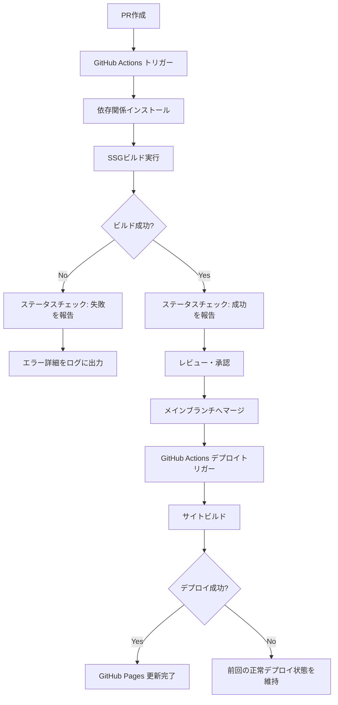
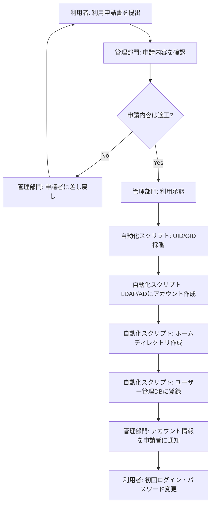
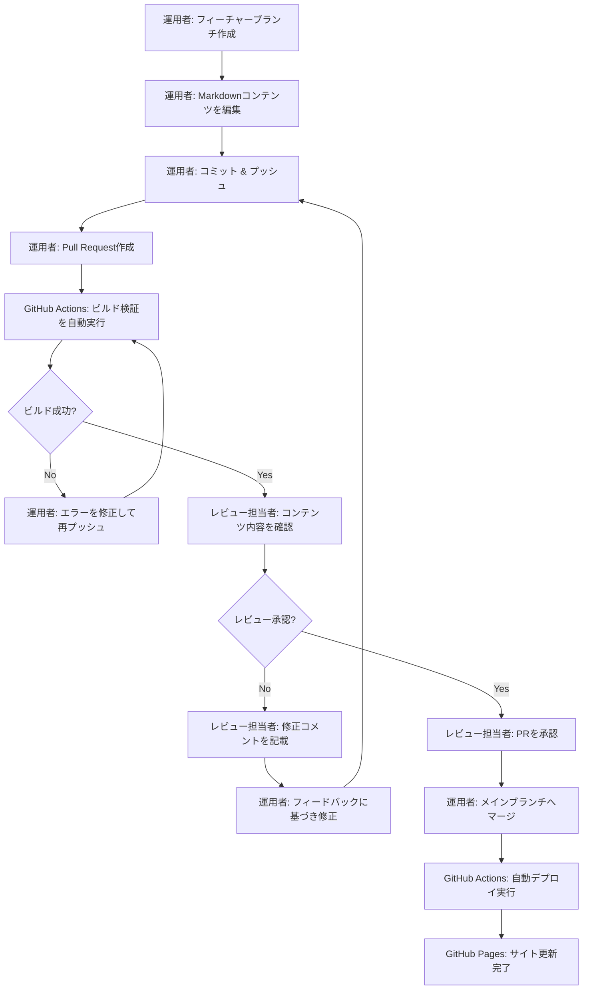

# 要件定義書

## はじめに

本ドキュメントは、HPCシステムのインフラ構成を「機能・サービス視点」で可視化するドキュメントサイトの要件を定義する。本サイトはGitHub Pagesでホスティングし、GitHub Actionsによる自動デプロイパイプラインを備える。対象利用者はシステム運用者であり、HPCインフラの全体像を構造的に把握・管理するための情報基盤として機能する。

## 用語集

- **ドキュメントサイト**: GitHub Pagesでホスティングされる静的サイト生成ツールベースのWebサイト
- **SSGエンジン**: 静的サイト生成ツール（Static Site Generator）。MarkdownファイルからHTMLサイトを生成する
- **デプロイパイプライン**: GitHub Actionsで構成されるCI/CDワークフロー。ビルド・検証・デプロイを自動実行する
- **コンテンツファイル**: Markdownで記述されたドキュメントソースファイル
- **ナビゲーション**: サイト内のカテゴリ・ページ間を移動するためのメニュー構造
- **検索機能**: サイト内のコンテンツをキーワードで全文検索する機能
- **構成図**: Mermaid記法等で記述されたネットワーク・システム構成のダイアグラム
- **運用者**: HPCシステムの管理・運用を担当するシステム管理者
- **レビューワークフロー**: Pull Requestベースのコンテンツ変更レビュー・承認プロセス
- **コンテンツカテゴリ**: サイト内の主要な情報分類単位（ユーザーアクセス、計算リソース、アプリケーション、データ管理、ネットワーク等）

## 要件

### 要件1: 静的サイト生成とホスティング

**ユーザーストーリー:** 運用者として、HPCインフラの構成情報をWebサイトとして閲覧したい。それにより、システム全体の構成を一元的に把握できる。

#### 受け入れ基準

1. THE ドキュメントサイト SHALL SSGエンジンを使用してMarkdownコンテンツファイルからHTMLサイトを生成する
2. THE ドキュメントサイト SHALL GitHub Pagesでホスティングされる
3. THE ドキュメントサイト SHALL レスポンシブデザインに対応し、デスクトップおよびタブレット端末で閲覧可能である
4. WHEN コンテンツファイルが追加または更新された場合、THE SSGエンジン SHALL 該当ページを含むサイト全体を再生成する

### 要件2: CI/CDデプロイパイプライン

**ユーザーストーリー:** 運用者として、コンテンツの変更がレビュー・マージ後に自動でサイトに反映されてほしい。それにより、手動デプロイの手間とミスを排除できる。

#### 受け入れ基準

1. WHEN Pull Requestがメインブランチにマージされた場合、THE デプロイパイプライン SHALL サイトのビルドとGitHub Pagesへのデプロイを自動実行する
2. WHEN Pull Requestが作成された場合、THE デプロイパイプライン SHALL ビルドの成功可否を検証しステータスチェックとして結果を報告する
3. THE デプロイパイプライン SHALL ビルドエラー発生時にGitHub Actionsのログにエラー詳細を出力する
4. IF デプロイが失敗した場合、THEN THE デプロイパイプライン SHALL 前回の正常デプロイ状態を維持する

#### 補足: CI/CDデプロイパイプラインフロー図（サンプル）

以下はデプロイパイプラインの処理フローを示すMermaidダイアグラムのサンプルである。

### 要件3: サイトナビゲーションとコンテンツ構造

**ユーザーストーリー:** 運用者として、HPCインフラの情報をカテゴリ別に整理されたナビゲーションで探したい。それにより、必要な情報に素早くアクセスできる。

#### 受け入れ基準

1. THE ドキュメントサイト SHALL 以下の5つのトップレベルコンテンツカテゴリをナビゲーションに表示する：「ユーザーアクセス・認証・ポータル」「計算リソース・ジョブ管理」「アプリケーション・ライセンス」「データ管理・基盤サービス・運用管理」「ネットワーク」
2. THE ドキュメントサイト SHALL 各トップレベルカテゴリの配下にサブカテゴリページへのリンクを階層的に表示する
3. THE ドキュメントサイト SHALL サイドバーナビゲーションで現在のページ位置をハイライト表示する
4. THE ドキュメントサイト SHALL パンくずリストを表示し、現在のページの階層位置を示す

### 要件4: サイト内検索

**ユーザーストーリー:** 運用者として、キーワードでサイト内のコンテンツを検索したい。それにより、カテゴリ構造を辿らずに目的の情報を見つけられる。

#### 受け入れ基準

1. THE 検索機能 SHALL サイト内の全コンテンツファイルを対象にキーワード全文検索を提供する
2. WHEN 運用者が検索キーワードを入力した場合、THE 検索機能 SHALL 一致するページのタイトルと該当箇所の抜粋をリスト表示する
3. THE 検索機能 SHALL クライアントサイドで動作し、外部検索サービスへの依存を持たない

### 要件5: 構成図の表示

**ユーザーストーリー:** 運用者として、ネットワーク構成やシステム構成をダイアグラムで視覚的に確認したい。それにより、テキストだけでは把握しにくい構成関係を直感的に理解できる。

#### 受け入れ基準

1. THE ドキュメントサイト SHALL Mermaid記法で記述された構成図をSVGとしてレンダリング表示する
2. THE ドキュメントサイト SHALL 構成図をMarkdownファイル内にコードブロックとして埋め込み可能にする
3. WHEN 構成図のMermaid記法が構文エラーを含む場合、THE ドキュメントサイト SHALL エラーメッセージを該当箇所に表示する

### 要件6: ユーザーアクセス・認証・ポータルカテゴリのコンテンツ

**ユーザーストーリー:** 運用者として、ユーザー管理・認証基盤・利用ポータルの構成情報を一元的に参照したい。それにより、アカウント管理や認証関連の運用を効率化できる。

#### 受け入れ基準

1. THE ドキュメントサイト SHALL ユーザー登録フロー（申請からアカウント作成までの自動化スクリプト仕様、承認フロー）を記述するページを含む
2. THE ドキュメントサイト SHALL 複数のユーザー管理DB一覧と各DBの独立性・データ連携状況を記述するページを含む
3. THE ドキュメントサイト SHALL 人事・組織変更との同期連携の有無、退職・部署移動時の自動連携状況を記述するページを含む
4. THE ドキュメントサイト SHALL ユーザーの定期棚卸方法を記述するページを含む
5. THE ドキュメントサイト SHALL システム管理者権限の運用者への割り当て方針を記述するページを含む
6. THE ドキュメントサイト SHALL UID/GIDの採番ルールとグループ所属ポリシーを記述するページを含む
7. THE ドキュメントサイト SHALL 退職・プロジェクト終了時のアカウントロック・削除手順を記述するページを含む
8. THE ドキュメントサイト SHALL LDAP/AD参照構成、ツリー構成、計算ノードへの認証情報同期方式を記述するページを含む
9. THE ドキュメントサイト SHALL 利用ポータルのWeb画面機能一覧、SSH接続方法、ポータル保守手順、ジョブ投入ユースケースを記述するページを含む
10. THE ドキュメントサイト SHALL ポータル裏側のWebサーバーとスケジューラ/DB連携API、ログ出力先を記述するページを含む

#### 補足: ユーザー登録フロー図（サンプル）

以下はユーザー登録の申請から承認・アカウント作成までのフローを示すMermaidダイアグラムのサンプルである。

### 要件7: 計算リソース・ジョブ管理カテゴリのコンテンツ

**ユーザーストーリー:** 運用者として、計算リソースの構成とジョブ管理の設計情報を参照したい。それにより、リソース割り当てやジョブスケジューリングの運用判断を迅速に行える。

#### 受け入れ基準

1. THE ドキュメントサイト SHALL 計算機種別ごとのノードタイプ・論理スペック定義を記述するページを含む
2. THE ドキュメントサイト SHALL 仮想基盤・仮想マシン情報の構成を記述するページを含む
3. THE ドキュメントサイト SHALL キュー名と対応ノード群、利用対象者、制限値を含むキュー設計・パーティション定義を記述するページを含む
4. THE ドキュメントサイト SHALL ジョブスケジューラの優先順位ロジックおよびProlog/Epilogスクリプト仕様を記述するページを含む
5. THE ドキュメントサイト SHALL Docker利用方法、イメージ管理、プライベートコンテナ要件を記述するページを含む

### 要件8: アプリケーション・ライセンスカテゴリのコンテンツ

**ユーザーストーリー:** 運用者として、CAEソフトウェアやライセンスサーバの構成情報を参照したい。それにより、ソフトウェア環境の管理とライセンス運用を適切に行える。

#### 受け入れ基準

1. THE ドキュメントサイト SHALL CAEソフトのバージョン管理、ライセンスポリシー、moduleコマンド設定、サポート範囲を記述するページを含む
2. THE ドキュメントサイト SHALL FlexLM/RLMライセンスサーバの構成、利用状況確認方法、アクセス制限を記述するページを含む
3. THE ドキュメントサイト SHALL GitHub Server構成・運用、利用申請、認証方式、バックアップ方針を記述するページを含む

### 要件9: データ管理・基盤サービス・運用管理カテゴリのコンテンツ

**ユーザーストーリー:** 運用者として、ストレージ・DNS・監視・バックアップ等の基盤サービス構成を参照したい。それにより、日常運用と障害対応を効率的に行える。

#### 受け入れ基準

1. THE ドキュメントサイト SHALL 共有ストレージ（Lustre）のクォータ、パージポリシー、マウント構成を記述するページを含む
2. THE ドキュメントサイト SHALL ファイル共有（NAS-GW）のアクセス権設定と用途使い分けを記述するページを含む
3. THE ドキュメントサイト SHALL DNS/NTPのフォワーディング設定とホスト登録運用フローを記述するページを含む
4. THE ドキュメントサイト SHALL 監視項目一覧と通知設定を記述するページを含む
5. THE ドキュメントサイト SHALL バックアップ対象・頻度、リストア手順、サービス合意を記述するページを含む
6. THE ドキュメントサイト SHALL 課金ロジックと稼働統計集計方法を記述するページを含む

### 要件10: ネットワークカテゴリのコンテンツ

**ユーザーストーリー:** 運用者として、HPCネットワークの論理構成とアドレス管理情報を参照したい。それにより、ネットワーク関連の設計変更や障害対応を迅速に行える。

#### 受け入れ基準

1. THE ドキュメントサイト SHALL HPC/管理/InfiniBand/基幹ネットワークの役割と論理構成を記述するページを含む
2. THE ドキュメントサイト SHALL サブネットおよびVLAN構成図をMermaid記法で記述するページを含む
3. THE ドキュメントサイト SHALL IPアドレス管理情報（サブネット割り当て、予約アドレス帯）を記述するページを含む

### 要件11: 補助コンテンツ

**ユーザーストーリー:** 運用者として、マニュアル・FAQ・稼働状況などの補助情報にもアクセスしたい。それにより、日常的な問い合わせ対応や利用者サポートを効率化できる。

#### 受け入れ基準

1. THE ドキュメントサイト SHALL ユーザー向けマニュアル・利用手順書・チュートリアルを掲載するセクションを含む
2. THE ドキュメントサイト SHALL よくある質問（FAQ）を掲載するセクションを含む
3. THE ドキュメントサイト SHALL システム稼働状況の公開レベル定義と表示方法を記述するページを含む

### 要件12: コンテンツ管理とレビュープロセス

**ユーザーストーリー:** 運用者として、コンテンツの変更をPull Requestベースでレビュー・承認してから公開したい。それにより、不正確な情報の公開を防止できる。

#### 受け入れ基準

1. THE レビューワークフロー SHALL コンテンツ変更をPull Request経由で提出する運用を前提とする
2. WHEN Pull Requestが作成された場合、THE デプロイパイプライン SHALL ビルド検証を自動実行しレビュー担当者に検証結果を提示する
3. THE ドキュメントサイト SHALL コンテンツファイルをMarkdown形式で管理し、運用者がテキストエディタで編集可能にする

#### 補足: コンテンツ更新レビューフロー図（サンプル）

以下はコンテンツ変更の提出からレビュー・承認・公開までのフローを示すMermaidダイアグラムのサンプルである。

