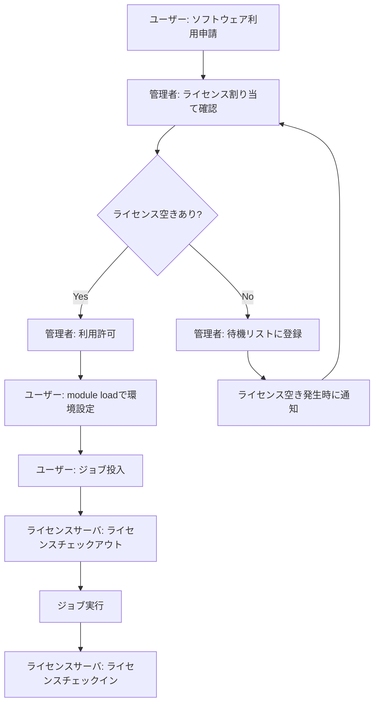

# CAEソフトウェア

## 概要

本ページでは、HPCシステムで利用可能なCAE（Computer Aided Engineering）ソフトウェアのバージョン管理方針、ライセンスポリシー、Environment Modules（moduleコマンド）による環境設定、ベンダーサポート範囲を記述する。

## ソフトウェアバージョン管理

### インストール済みソフトウェア一覧

<!-- 実際のソフトウェア情報を記載 -->

| ソフトウェア名 | バージョン | インストールパス | ライセンス種別 | サポート期限 |
|---|---|---|---|---|
| （要記入） | （要記入） | （要記入） | （要記入） | （要記入） |
| （要記入） | （要記入） | （要記入） | （要記入） | （要記入） |
| （要記入） | （要記入） | （要記入） | （要記入） | （要記入） |

### バージョン管理方針

<!-- バージョン管理のルールを記載 -->

- 新バージョン導入基準: （要記入）
- 旧バージョン保持期間: （要記入）
- バージョン切り替え通知方法: （要記入）
- テスト・検証手順: （要記入）

## moduleコマンド設定

### module利用方法

```bash
# 利用可能なモジュール一覧を表示
module avail

# モジュールをロード
module load （ソフトウェア名）/（バージョン）

# 現在ロード中のモジュールを確認
module list

# モジュールをアンロード
module unload （ソフトウェア名）/（バージョン）

# モジュールを切り替え
module switch （旧モジュール） （新モジュール）
```

### moduleファイル構成

<!-- moduleファイルの配置場所と構成を記載 -->

| 項目 | 内容 |
|---|---|
| moduleファイル配置パス | （要記入） |
| moduleファイル形式 | （要記入） |
| 環境変数設定内容 | （要記入） |
| 依存モジュール管理 | （要記入） |

### moduleファイル例

```bash
# moduleファイルのサンプル
# （要記入）
```

## ライセンスポリシー

### ライセンス種別と利用ルール

<!-- 各ソフトウェアのライセンスポリシーを記載 -->

| ソフトウェア名 | ライセンス種別 | 同時利用数 | 利用対象者 | 利用制限事項 |
|---|---|---|---|---|
| （要記入） | （要記入） | （要記入） | （要記入） | （要記入） |
| （要記入） | （要記入） | （要記入） | （要記入） | （要記入） |
| （要記入） | （要記入） | （要記入） | （要記入） | （要記入） |

### ライセンス利用フロー



### ライセンス超過時の対応

- ライセンス超過時の挙動: （要記入）
- ユーザーへの通知方法: （要記入）
- 優先度制御: （要記入）

## ベンダーサポート

### サポート契約一覧

<!-- ベンダーサポート情報を記載 -->

| ソフトウェア名 | ベンダー名 | サポート契約種別 | 契約期間 | 問い合わせ先 |
|---|---|---|---|---|
| （要記入） | （要記入） | （要記入） | （要記入） | （要記入） |
| （要記入） | （要記入） | （要記入） | （要記入） | （要記入） |

### サポート範囲

- 技術サポート対象: （要記入）
- バグ修正・パッチ提供: （要記入）
- バージョンアップグレード: （要記入）
- トレーニング・ドキュメント: （要記入）

## 運用手順

- ソフトウェアインストール手順: （要記入）
- moduleファイル作成・更新手順: （要記入）
- ライセンスファイル更新手順: （要記入）
- バージョンアップグレード手順: （要記入）
- ソフトウェア削除手順: （要記入）

## 関連ページ

- [ライセンスサーバ](license-server.md)
- [コンテナ](../compute/container.md)
- [キュー設計](../compute/queue-design.md)
- [ジョブスケジューラ](../compute/scheduler.md)
