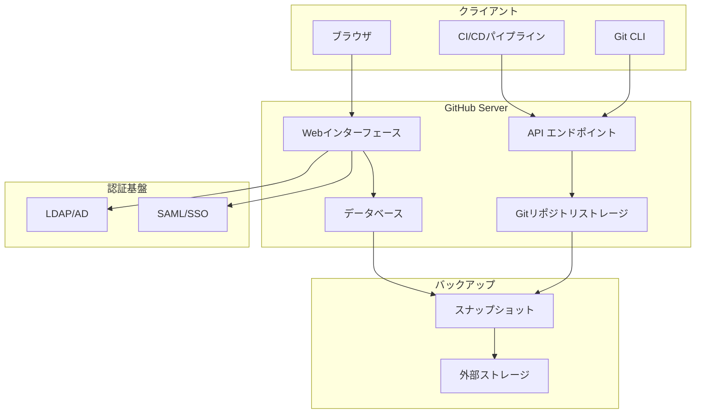
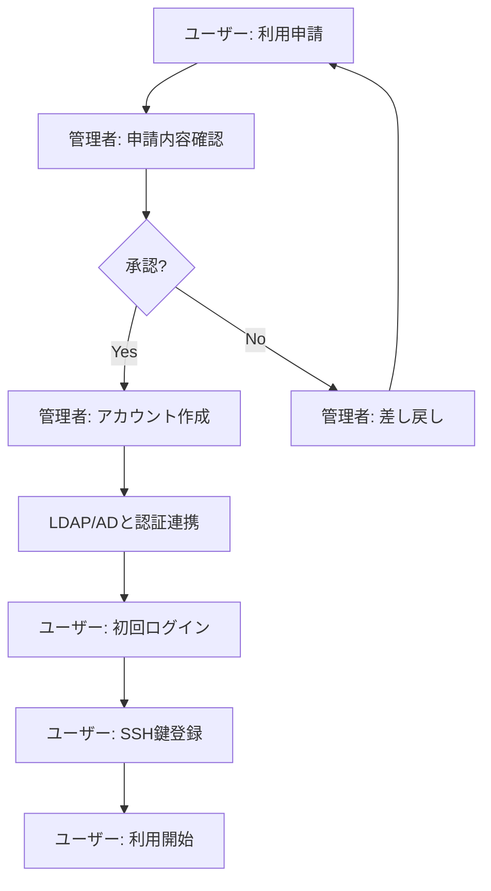

# GitHub Server

## 概要

本ページでは、HPCシステム環境で運用するGitHub Server（GitHub Enterprise Server）の構成、ユーザー認証方式、リポジトリ管理方針、バックアップ・リストア手順を記述する。

## サーバ構成

### サーバ情報

<!-- 実際のサーバ情報を記載 -->

| 項目 | 内容 |
|---|---|
| ホスト名 | （要記入） |
| IPアドレス | （要記入） |
| OS | （要記入） |
| バージョン | （要記入） |
| CPU/メモリ | （要記入） |
| ディスク容量 | （要記入） |
| アクセスURL | （要記入） |

### サーバ構成図



## ユーザー認証

### 認証方式

<!-- 認証方式の詳細を記載 -->

| 項目 | 内容 |
|---|---|
| 認証方式 | （要記入） |
| LDAP/AD連携 | （要記入） |
| SAML/SSO設定 | （要記入） |
| 二要素認証 | （要記入） |
| SSH鍵管理 | （要記入） |
| Personal Access Token | （要記入） |

### 利用申請フロー



### アクセス権限

| 権限レベル | 説明 | 対象者 |
|---|---|---|
| Owner | Organization管理権限 | （要記入） |
| Admin | リポジトリ管理権限 | （要記入） |
| Write | リポジトリ書き込み権限 | （要記入） |
| Read | リポジトリ読み取り権限 | （要記入） |

## リポジトリ管理

### Organization構成

<!-- Organization構成を記載 -->

| Organization名 | 用途 | 管理者 | メンバー数 |
|---|---|---|---|
| （要記入） | （要記入） | （要記入） | （要記入） |
| （要記入） | （要記入） | （要記入） | （要記入） |

### リポジトリ管理方針

- リポジトリ作成ルール: （要記入）
- 命名規則: （要記入）
- 可視性ポリシー（Public/Private/Internal）: （要記入）
- アーカイブ・削除ポリシー: （要記入）
- リポジトリサイズ上限: （要記入）

### ブランチ保護ルール

| ルール | 設定内容 |
|---|---|
| デフォルトブランチ | （要記入） |
| プルリクエスト必須 | （要記入） |
| レビュー承認数 | （要記入） |
| ステータスチェック必須 | （要記入） |
| 強制プッシュ禁止 | （要記入） |

## バックアップ・リストア

### バックアップ方針

<!-- バックアップの詳細を記載 -->

| 項目 | 内容 |
|---|---|
| バックアップ方式 | （要記入） |
| バックアップ頻度 | （要記入） |
| バックアップ保持期間 | （要記入） |
| バックアップ保存先 | （要記入） |
| バックアップ対象 | （要記入） |

### バックアップ手順

```bash
# GitHub Enterprise Serverバックアップの実行例
# （要記入）
```

### リストア手順

```bash
# GitHub Enterprise Serverリストアの実行例
# （要記入）
```

### 災害復旧（DR）

| 項目 | 内容 |
|---|---|
| RPO（目標復旧時点） | （要記入） |
| RTO（目標復旧時間） | （要記入） |
| DR手順書 | （要記入） |
| DR訓練頻度 | （要記入） |

## 運用手順

- サーバ起動・停止手順: （要記入）
- バージョンアップグレード手順: （要記入）
- SSL証明書更新手順: （要記入）
- ストレージ容量監視・拡張手順: （要記入）
- ユーザーアカウント棚卸手順: （要記入）
- 障害時の対応手順: （要記入）

## 関連ページ

- [ユーザーアクセス・認証・ポータル](../user-access/index.md)
- [LDAP/AD構成](../user-access/ldap-ad.md)
- [バックアップ](../data-ops/backup.md)
- [監視](../data-ops/monitoring.md)
