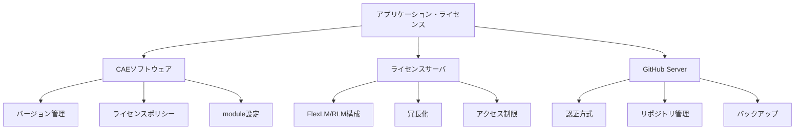

# アプリケーション・ライセンス

## 概要

本カテゴリでは、HPCシステムで利用するアプリケーションソフトウェアとライセンス管理に関する構成情報を記述する。CAEソフトウェアのバージョン管理・moduleコマンド設定、FlexLM/RLMライセンスサーバの構成、GitHub Serverの運用をカバーする。

## 対象範囲

- CAEソフトウェアのバージョン管理・ライセンスポリシー・module設定
- FlexLM/RLMライセンスサーバの構成・冗長化・アクセス制限
- GitHub Serverの構成・認証・バックアップ

## カテゴリ構成図

## 各ページ一覧

| ページ | 概要 |
|---|---|
| [CAEソフトウェア](cae-software.md) | CAEソフトのバージョン管理・ライセンスポリシー・module設定 |
| [ライセンスサーバ](license-server.md) | FlexLM/RLMライセンスサーバの構成・利用状況確認・アクセス制限 |
| [GitHub Server](github-server.md) | GitHub Serverの構成・運用・認証・バックアップ |

## 関連ページ

- [計算リソース・ジョブ管理](../compute/index.md)
- [ユーザーアクセス・認証・ポータル](../user-access/index.md)
- [データ管理・基盤サービス・運用管理](../data-ops/index.md)
