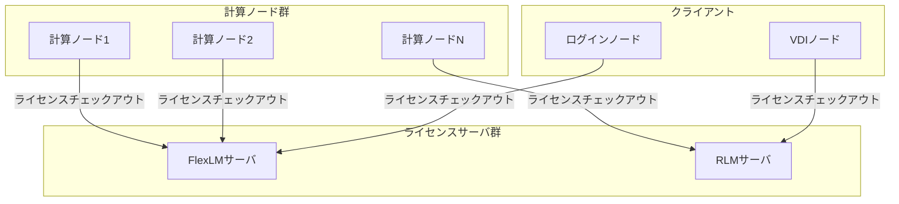

# ライセンスサーバ

## 概要

本ページでは、HPCシステムで利用するFlexLM（FlexNet Publisher）およびRLM（Reprise License Manager）ライセンスサーバの構成、ポート設定、冗長化構成、フィーチャーライセンス数の管理、アクセス制限を記述する。

## サーバ構成

### ライセンスサーバ一覧

<!-- 実際のサーバ情報を記載 -->

| サーバ名 | IPアドレス | ライセンスマネージャ | 管理対象ソフトウェア | OS |
|---|---|---|---|---|
| （要記入） | （要記入） | FlexLM | （要記入） | （要記入） |
| （要記入） | （要記入） | RLM | （要記入） | （要記入） |
| （要記入） | （要記入） | （要記入） | （要記入） | （要記入） |

### ライセンスサーバ構成図



## ポート番号

### FlexLMポート設定

<!-- 実際のポート情報を記載 -->

| サービス | ポート番号 | プロトコル | 用途 |
|---|---|---|---|
| lmgrd | （要記入） | TCP | ライセンスマネージャデーモン |
| ベンダーデーモン | （要記入） | TCP | ベンダー固有デーモン |
| （要記入） | （要記入） | （要記入） | （要記入） |

### RLMポート設定

| サービス | ポート番号 | プロトコル | 用途 |
|---|---|---|---|
| rlm | （要記入） | TCP | RLMデーモン |
| ISVサーバ | （要記入） | TCP | ISV固有サーバ |
| Web管理画面 | （要記入） | TCP | RLM Web管理インターフェース |

## 冗長化構成

<!-- 冗長化構成の情報を記載 -->

### FlexLM冗長化

| 項目 | 内容 |
|---|---|
| 冗長化方式 | （要記入） |
| プライマリサーバ | （要記入） |
| セカンダリサーバ | （要記入） |
| フェイルオーバー条件 | （要記入） |
| 復旧手順 | （要記入） |

### RLM冗長化

| 項目 | 内容 |
|---|---|
| 冗長化方式 | （要記入） |
| プライマリサーバ | （要記入） |
| セカンダリサーバ | （要記入） |
| フェイルオーバー条件 | （要記入） |
| 復旧手順 | （要記入） |

## フィーチャーライセンス数

### ライセンス数一覧

<!-- 各ソフトウェアのフィーチャーライセンス数を記載 -->

| ソフトウェア名 | フィーチャー名 | ライセンス数 | ライセンス種別 | 有効期限 |
|---|---|---|---|---|
| （要記入） | （要記入） | （要記入） | （要記入） | （要記入） |
| （要記入） | （要記入） | （要記入） | （要記入） | （要記入） |
| （要記入） | （要記入） | （要記入） | （要記入） | （要記入） |

### ライセンス利用状況確認方法

```bash
# FlexLM: ライセンス利用状況の確認
lmstat -a -c （ライセンスファイルパス）

# FlexLM: 特定フィーチャーの利用状況確認
lmstat -f （フィーチャー名） -c （ライセンスファイルパス）

# RLM: ライセンス利用状況の確認
rlmstat -a -c （ポート番号）@（サーバ名）

# RLM: 特定ISVの利用状況確認
rlmstat -i （ISV名） -c （ポート番号）@（サーバ名）
```

## アクセス制限

### ネットワークアクセス制限

<!-- アクセス制限の設定を記載 -->

| 制限項目 | 設定内容 |
|---|---|
| 許可ネットワーク | （要記入） |
| ファイアウォールルール | （要記入） |
| VPN経由アクセス | （要記入） |

### ユーザーアクセス制限

| 制限項目 | 設定内容 |
|---|---|
| ユーザーグループ制限 | （要記入） |
| ホスト制限 | （要記入） |
| 時間帯制限 | （要記入） |
| オプションファイル設定 | （要記入） |

## ライセンスファイル管理

<!-- ライセンスファイルの管理情報を記載 -->

| 項目 | 内容 |
|---|---|
| ライセンスファイル配置パス | （要記入） |
| ライセンスファイル形式 | （要記入） |
| 更新手順 | （要記入） |
| バックアップ方法 | （要記入） |

## 運用手順

- ライセンスサーバ起動・停止手順: （要記入）
- ライセンスファイル更新手順: （要記入）
- ライセンス利用状況レポート作成手順: （要記入）
- ライセンスサーバ障害時の対応手順: （要記入）
- ライセンス期限切れ時の更新手順: （要記入）

## 関連ページ

- [CAEソフトウェア](cae-software.md)
- [ノードタイプ](../compute/node-types.md)
- [ネットワーク](../network/index.md)
