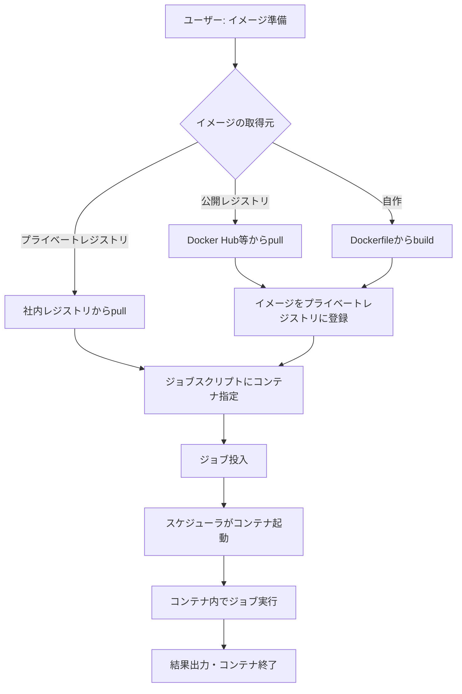

# Docker利用方法・イメージ管理

## 概要

本ページでは、HPCシステムにおけるDockerコンテナの利用方法、コンテナイメージの管理方針、プライベートコンテナレジストリの構成と要件を記述する。

## コンテナ実行環境

<!-- 実際のコンテナ実行環境情報を記載 -->

| 項目 | 内容 |
|---|---|
| コンテナランタイム | （要記入） |
| バージョン | （要記入） |
| 利用可能ノード | （要記入） |
| GPU対応 | （要記入） |
| ネットワークモード | （要記入） |

## コンテナ利用フロー



## コンテナレジストリ

<!-- プライベートコンテナレジストリの情報を記載 -->

| 項目 | 内容 |
|---|---|
| レジストリ種別 | （要記入） |
| レジストリURL | （要記入） |
| 認証方式 | （要記入） |
| ストレージ容量 | （要記入） |
| イメージ保持ポリシー | （要記入） |

## イメージ管理

### 公式提供イメージ

<!-- システム側で提供するベースイメージの一覧を記載 -->

| イメージ名 | 用途 | ベースOS | 主要パッケージ | 更新頻度 |
|---|---|---|---|---|
| （要記入） | 汎用計算 | （要記入） | （要記入） | （要記入） |
| （要記入） | GPU計算 | （要記入） | （要記入） | （要記入） |
| （要記入） | CAEソフトウェア | （要記入） | （要記入） | （要記入） |

### ユーザーカスタムイメージ

<!-- ユーザーが独自イメージを作成する際のルールを記載 -->

- ベースイメージ制限: （要記入）
- イメージサイズ上限: （要記入）
- セキュリティ要件: （要記入）
- 命名規則: （要記入）

## プライベートコンテナ要件

<!-- プライベートコンテナの利用要件を記載 -->

### セキュリティ要件

- rootレス実行: （要記入）
- ネットワーク制限: （要記入）
- ボリュームマウント制限: （要記入）
- 特権モード: （要記入）

### リソース制限

- CPU制限: （要記入）
- メモリ制限: （要記入）
- ディスクI/O制限: （要記入）
- GPU割り当て: （要記入）

## ジョブスクリプトでの利用例

<!-- 実際のジョブスクリプト例を記載 -->

```bash
# コンテナを使用したジョブスクリプトの例
# （要記入）
```

## 運用手順

- レジストリメンテナンス手順: （要記入）
- イメージ脆弱性スキャン手順: （要記入）
- 不要イメージのクリーンアップ手順: （要記入）
- コンテナランタイム更新手順: （要記入）

## 関連ページ

- [ノードタイプ](node-types.md)
- [キュー設計](queue-design.md)
- [ジョブスケジューラ](scheduler.md)
- [アプリケーション・ライセンス](../applications/index.md)
