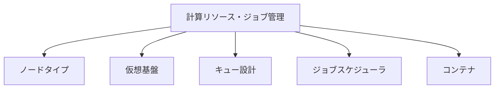

# 計算リソース・ジョブ管理

## 概要

本カテゴリでは、HPCシステムにおける計算リソースの構成とジョブ管理の設計情報を記述する。ノードタイプの定義、仮想基盤構成、キュー設計、ジョブスケジューラの優先順位ロジック、コンテナ利用方法をカバーする。

## 対象範囲

- 計算機種別ごとのノードタイプ・論理スペック定義
- 仮想基盤・仮想マシン構成
- キュー設計・パーティション定義
- ジョブスケジューラの優先順位ロジックとProlog/Epilogスクリプト
- Docker利用方法・イメージ管理

## カテゴリ構成図

## 各ページ一覧

| ページ | 概要 |
|---|---|
| [ノードタイプ](node-types.md) | 計算機種別ごとのノードタイプ・論理スペック定義 |
| [仮想基盤](virtual-infra.md) | 仮想基盤・仮想マシン構成 |
| [キュー設計](queue-design.md) | キュー名と対応ノード群、利用対象者、制限値 |
| [ジョブスケジューラ](scheduler.md) | 優先順位ロジック・Prolog/Epilogスクリプト仕様 |
| [コンテナ](container.md) | Docker利用方法・イメージ管理・プライベートコンテナ要件 |

## 関連ページ

- [ユーザーアクセス・認証・ポータル](../user-access/index.md)
- [アプリケーション・ライセンス](../applications/index.md)
- [データ管理・基盤サービス・運用管理](../data-ops/index.md)
