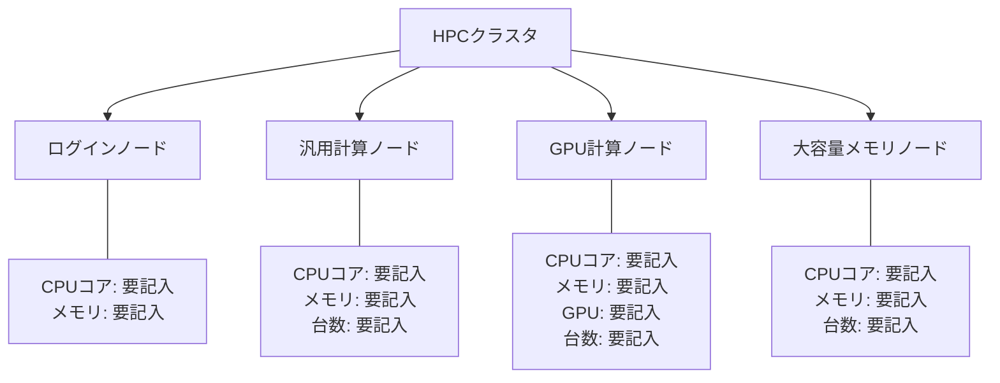

# ノードタイプ・論理スペック定義

## 概要

本ページでは、HPCシステムで運用されている計算機種別ごとのノードタイプと、各ノードの論理スペック（CPUコア数、メモリ容量、GPU数等）を定義する。

## ノードタイプ一覧

<!-- 実際のノードタイプ情報を記載 -->

| ノードタイプ | 用途 | CPUコア数 | メモリ (GB) | GPU数 | GPUモデル | ローカルストレージ | 台数 |
|---|---|---|---|---|---|---|---|
| （要記入） | 汎用計算 | （要記入） | （要記入） | - | - | （要記入） | （要記入） |
| （要記入） | GPU計算 | （要記入） | （要記入） | （要記入） | （要記入） | （要記入） | （要記入） |
| （要記入） | 大容量メモリ | （要記入） | （要記入） | - | - | （要記入） | （要記入） |
| （要記入） | ログインノード | （要記入） | （要記入） | - | - | （要記入） | （要記入） |

## ノード構成図

## 各ノードタイプ詳細

### 汎用計算ノード

<!-- 汎用計算ノードの詳細スペックを記載 -->

- CPU: （要記入）
- メモリ: （要記入）
- ネットワーク: （要記入）
- OS: （要記入）
- 備考: （要記入）

### GPU計算ノード

<!-- GPU計算ノードの詳細スペックを記載 -->

- CPU: （要記入）
- メモリ: （要記入）
- GPU: （要記入）
- ネットワーク: （要記入）
- OS: （要記入）
- 備考: （要記入）

### 大容量メモリノード

<!-- 大容量メモリノードの詳細スペックを記載 -->

- CPU: （要記入）
- メモリ: （要記入）
- ネットワーク: （要記入）
- OS: （要記入）
- 備考: （要記入）

### ログインノード

<!-- ログインノードの詳細スペックを記載 -->

- CPU: （要記入）
- メモリ: （要記入）
- ネットワーク: （要記入）
- OS: （要記入）
- 備考: （要記入）

## 運用手順

- ノード追加・撤去手順: （要記入）
- ハードウェア障害時の対応手順: （要記入）
- ファームウェア更新手順: （要記入）

## 関連ページ

- [キュー設計](queue-design.md)
- [仮想基盤](virtual-infra.md)
- [ジョブスケジューラ](scheduler.md)
