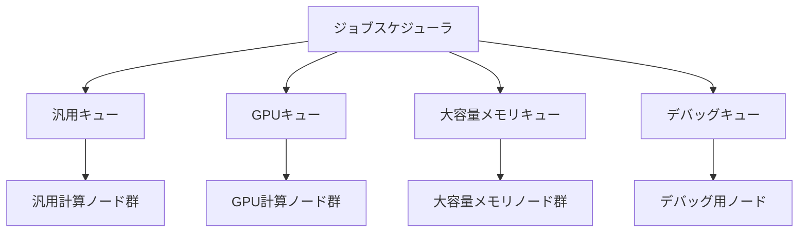

# キュー設計・パーティション定義

## 概要

本ページでは、HPCシステムのジョブキュー設計とパーティション定義を記述する。各キューの名称、対応するノード群、利用対象者、リソース制限値を含む。

## キュー一覧

<!-- 実際のキュー情報を記載 -->

| キュー名 | 対応ノード群 | 利用対象者 | 最大ノード数 | 最大実行時間 | 最大同時ジョブ数 | 優先度 |
|---|---|---|---|---|---|---|
| （要記入） | 汎用計算ノード | （要記入） | （要記入） | （要記入） | （要記入） | （要記入） |
| （要記入） | GPU計算ノード | （要記入） | （要記入） | （要記入） | （要記入） | （要記入） |
| （要記入） | 大容量メモリノード | （要記入） | （要記入） | （要記入） | （要記入） | （要記入） |
| （要記入） | デバッグ用 | （要記入） | （要記入） | （要記入） | （要記入） | （要記入） |

## パーティション構成図

## キュー詳細

### 汎用キュー

<!-- 汎用キューの詳細を記載 -->

- キュー名: （要記入）
- 対応ノード: （要記入）
- 利用対象者: （要記入）
- 最大ノード数: （要記入）
- 最大実行時間: （要記入）
- 最大同時ジョブ数: （要記入）
- デフォルトリソース: （要記入）

### GPUキュー

<!-- GPUキューの詳細を記載 -->

- キュー名: （要記入）
- 対応ノード: （要記入）
- 利用対象者: （要記入）
- 最大ノード数: （要記入）
- 最大実行時間: （要記入）
- 最大GPU数/ジョブ: （要記入）
- デフォルトリソース: （要記入）

### 大容量メモリキュー

<!-- 大容量メモリキューの詳細を記載 -->

- キュー名: （要記入）
- 対応ノード: （要記入）
- 利用対象者: （要記入）
- 最大ノード数: （要記入）
- 最大実行時間: （要記入）
- デフォルトリソース: （要記入）

### デバッグキュー

<!-- デバッグキューの詳細を記載 -->

- キュー名: （要記入）
- 対応ノード: （要記入）
- 利用対象者: （要記入）
- 最大ノード数: （要記入）
- 最大実行時間: （要記入）
- 備考: （要記入）

## アクセス制御

<!-- キューへのアクセス制御設定を記載 -->

| キュー名 | アクセス制御方式 | 許可グループ/ユーザー |
|---|---|---|
| （要記入） | （要記入） | （要記入） |

## 運用手順

- キュー追加手順: （要記入）
- キュー制限値変更手順: （要記入）
- キュー一時停止・再開手順: （要記入）
- 利用対象者変更手順: （要記入）

## 関連ページ

- [ノードタイプ](node-types.md)
- [ジョブスケジューラ](scheduler.md)
- [コンテナ](container.md)
