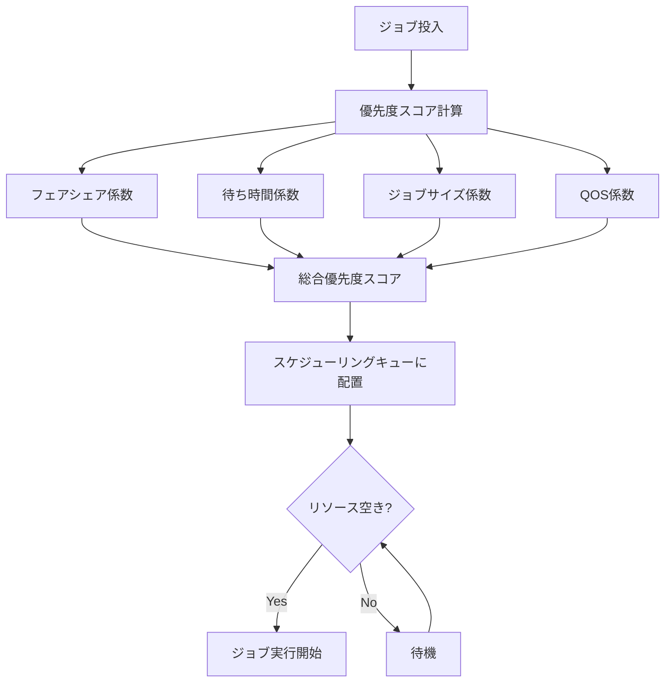
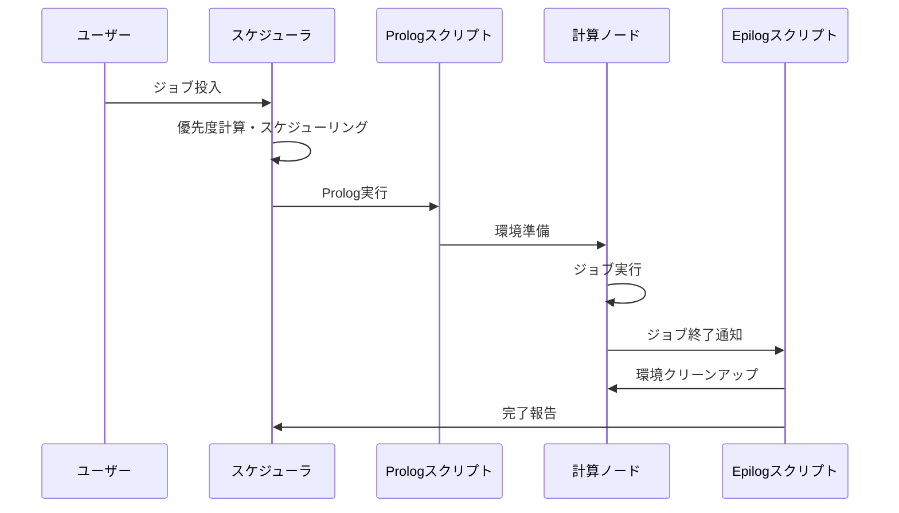

# ジョブスケジューラ優先順位・Prolog/Epilogスクリプト

## 概要

本ページでは、HPCシステムのジョブスケジューラにおける優先順位決定ロジック、フェアシェア設定、およびProlog/Epilogスクリプトの仕様を記述する。

## スケジューラ基本情報

<!-- 実際のスケジューラ情報を記載 -->

| 項目 | 内容 |
|---|---|
| スケジューラ種別 | （要記入） |
| バージョン | （要記入） |
| 設定ファイルパス | （要記入） |
| ログ出力先 | （要記入） |

## 優先順位ロジック

### 優先順位決定フロー

### 優先度パラメータ

<!-- 実際の優先度パラメータを記載 -->

| パラメータ | 重み | 説明 |
|---|---|---|
| フェアシェア | （要記入） | 過去の利用実績に基づく公平性調整 |
| 待ち時間（Age） | （要記入） | 待機時間に応じた優先度上昇 |
| ジョブサイズ | （要記入） | 要求リソース量に基づく調整 |
| QOS | （要記入） | サービス品質レベルに基づく優先度 |

### フェアシェア設定

<!-- フェアシェアの詳細設定を記載 -->

- 計算期間: （要記入）
- 減衰係数: （要記入）
- グループ単位/ユーザー単位: （要記入）
- シェア割り当て:

| グループ/ユーザー | シェア値 | 備考 |
|---|---|---|
| （要記入） | （要記入） | （要記入） |

## Prologスクリプト

<!-- ジョブ開始前に実行されるPrologスクリプトの仕様を記載 -->

### 概要

Prologスクリプトはジョブ実行開始前に各計算ノード上で実行され、実行環境の準備を行う。

| 項目 | 内容 |
|---|---|
| スクリプトパス | （要記入） |
| 実行タイミング | ジョブ開始前 |
| 実行ユーザー | （要記入） |
| タイムアウト | （要記入） |

### 処理内容

1. （要記入）
2. （要記入）
3. （要記入）

## Epilogスクリプト

<!-- ジョブ終了後に実行されるEpilogスクリプトの仕様を記載 -->

### 概要

Epilogスクリプトはジョブ終了後に各計算ノード上で実行され、環境のクリーンアップを行う。

| 項目 | 内容 |
|---|---|
| スクリプトパス | （要記入） |
| 実行タイミング | ジョブ終了後 |
| 実行ユーザー | （要記入） |
| タイムアウト | （要記入） |

### 処理内容

1. （要記入）
2. （要記入）
3. （要記入）

## Prolog/Epilog実行フロー

## 運用手順

- 優先度パラメータ変更手順: （要記入）
- フェアシェアリセット手順: （要記入）
- Prolog/Epilogスクリプト更新手順: （要記入）
- スケジューラ障害時の対応手順: （要記入）

## 関連ページ

- [キュー設計](queue-design.md)
- [ノードタイプ](node-types.md)
- [コンテナ](container.md)
