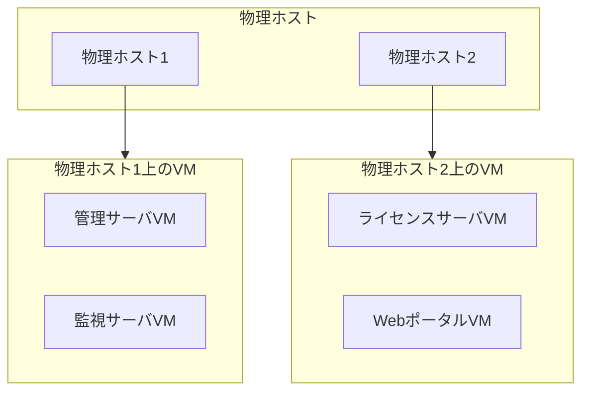

# 仮想基盤・仮想マシン構成

## 概要

本ページでは、HPCシステムで運用されている仮想基盤のハイパーバイザ構成、仮想マシン一覧、および各VMへのリソース割り当て情報を記述する。

## ハイパーバイザ構成

<!-- 実際のハイパーバイザ情報を記載 -->

| 項目 | 内容 |
|---|---|
| ハイパーバイザ種別 | （要記入） |
| バージョン | （要記入） |
| 管理ツール | （要記入） |
| 物理ホスト台数 | （要記入） |
| 総CPU割り当て可能コア数 | （要記入） |
| 総メモリ割り当て可能容量 | （要記入） |

## 仮想マシン一覧

<!-- 実際のVM情報を記載 -->

| VM名 | 用途 | vCPU | メモリ (GB) | ディスク (GB) | OS | 稼働ホスト |
|---|---|---|---|---|---|---|
| （要記入） | 管理サーバ | （要記入） | （要記入） | （要記入） | （要記入） | （要記入） |
| （要記入） | 監視サーバ | （要記入） | （要記入） | （要記入） | （要記入） | （要記入） |
| （要記入） | ライセンスサーバ | （要記入） | （要記入） | （要記入） | （要記入） | （要記入） |
| （要記入） | Webポータル | （要記入） | （要記入） | （要記入） | （要記入） | （要記入） |

## 仮想基盤構成図

## リソース割り当てポリシー

<!-- リソース割り当てのポリシーを記載 -->

- CPU割り当て方針: （要記入）
- メモリ割り当て方針: （要記入）
- ディスク割り当て方針: （要記入）
- オーバーコミット設定: （要記入）

## 高可用性（HA）構成

<!-- HA構成の詳細を記載 -->

- HA方式: （要記入）
- フェイルオーバー条件: （要記入）
- 自動復旧設定: （要記入）

## 運用手順

- VM作成手順: （要記入）
- VM削除手順: （要記入）
- リソース変更手順: （要記入）
- スナップショット・バックアップ手順: （要記入）
- 障害時のフェイルオーバー手順: （要記入）

## 関連ページ

- [ノードタイプ](node-types.md)
- [監視](../data-ops/monitoring.md)
- [バックアップ](../data-ops/backup.md)
