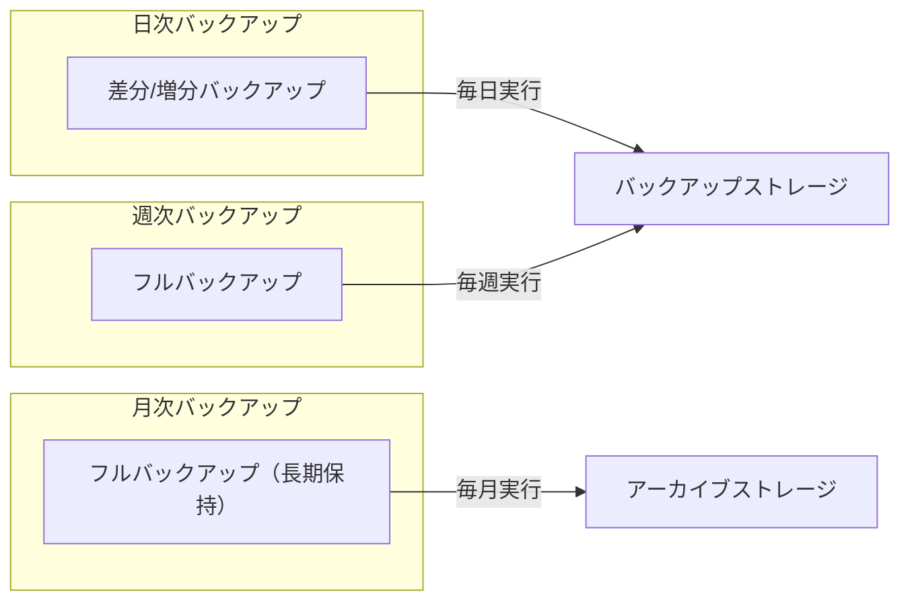
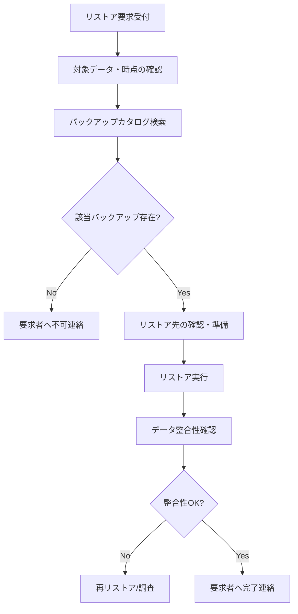

# バックアップ対象・頻度・リストア手順

## 概要

本ページでは、HPCシステムにおけるバックアップの対象・頻度、リストア手順、およびサービス合意（SLA）を記述する。

## バックアップ基盤情報

<!-- 実際のバックアップ基盤情報を記載 -->

| 項目 | 内容 |
|---|---|
| バックアップソフトウェア | （要記入） |
| バージョン | （要記入） |
| バックアップサーバ | （要記入） |
| バックアップ先ストレージ | （要記入） |
| 総バックアップ容量 | （要記入） |

## バックアップ対象・頻度

### バックアップ対象一覧

<!-- 実際のバックアップ対象を記載 -->

| 対象 | バックアップ種別 | 頻度 | 保持世代数 | 保持期間 | 備考 |
|---|---|---|---|---|---|
| ユーザーホームディレクトリ | （要記入） | （要記入） | （要記入） | （要記入） | （要記入） |
| システム設定ファイル | （要記入） | （要記入） | （要記入） | （要記入） | （要記入） |
| データベース | （要記入） | （要記入） | （要記入） | （要記入） | （要記入） |
| ログファイル | （要記入） | （要記入） | （要記入） | （要記入） | （要記入） |
| アプリケーション設定 | （要記入） | （要記入） | （要記入） | （要記入） | （要記入） |

### バックアップスケジュール

### バックアップ除外対象

<!-- バックアップ対象外の領域を記載 -->

| 除外対象 | 理由 |
|---|---|
| スクラッチ領域 | （要記入） |
| テンポラリ領域 | （要記入） |
| （要記入） | （要記入） |

## リストア手順

### リストアフロー

### リストア手順詳細

1. （要記入）
2. （要記入）
3. （要記入）

### リストア所要時間目安

<!-- 実際のリストア所要時間を記載 -->

| 対象 | データ量目安 | 所要時間目安 |
|---|---|---|
| ユーザーホーム（個別ファイル） | （要記入） | （要記入） |
| ユーザーホーム（全体） | （要記入） | （要記入） |
| システム設定 | （要記入） | （要記入） |
| データベース | （要記入） | （要記入） |

## サービス合意（SLA）

<!-- 実際のSLA情報を記載 -->

| 項目 | 合意内容 |
|---|---|
| バックアップ成功率目標 | （要記入） |
| リストア要求対応時間 | （要記入） |
| リストア完了目標時間 | （要記入） |
| データ保持期間 | （要記入） |
| RPO（目標復旧時点） | （要記入） |
| RTO（目標復旧時間） | （要記入） |

## 運用手順

- バックアップジョブ追加/変更手順: （要記入）
- バックアップ失敗時の対応手順: （要記入）
- バックアップストレージ容量逼迫時の対応: （要記入）
- 定期リストアテスト手順: （要記入）

## 関連ページ

- [共有ストレージ（Lustre）](shared-storage.md)
- [ファイル共有（NAS-GW）](nas-gw.md)
- [監視](monitoring.md)
