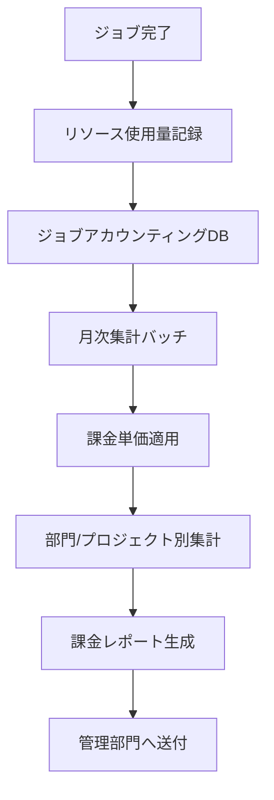
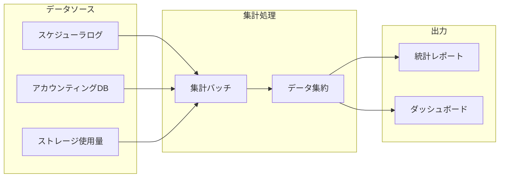

# 課金ロジック・稼働統計集計

## 概要

本ページでは、HPCシステムにおける課金ロジックの定義と稼働統計の集計方法を記述する。

## 課金基本情報

<!-- 実際の課金基本情報を記載 -->

| 項目 | 内容 |
|---|---|
| 課金単位 | （要記入） |
| 課金サイクル | （要記入） |
| 集計システム | （要記入） |
| レポート出力先 | （要記入） |

## 課金ロジック

### 課金対象リソース

<!-- 実際の課金対象リソースを記載 -->

| リソース種別 | 課金単位 | 単価 | 計算方法 | 備考 |
|---|---|---|---|---|
| CPU時間 | （要記入） | （要記入） | （要記入） | （要記入） |
| GPU時間 | （要記入） | （要記入） | （要記入） | （要記入） |
| メモリ使用量 | （要記入） | （要記入） | （要記入） | （要記入） |
| ストレージ容量 | （要記入） | （要記入） | （要記入） | （要記入） |
| ライセンス利用 | （要記入） | （要記入） | （要記入） | （要記入） |

### 課金計算フロー

### 課金ルール

<!-- 実際の課金ルールを記載 -->

| ルール | 内容 |
|---|---|
| 最小課金単位 | （要記入） |
| 端数処理 | （要記入） |
| 異常終了ジョブの扱い | （要記入） |
| 優先キュー利用時の割増 | （要記入） |
| 無料枠 | （要記入） |

## 稼働統計集計

### 集計項目

<!-- 実際の集計項目を記載 -->

| 集計項目 | 集計単位 | 集計頻度 | 出力形式 |
|---|---|---|---|
| ノード稼働率 | （要記入） | （要記入） | （要記入） |
| ジョブ投入数 | （要記入） | （要記入） | （要記入） |
| CPU利用率 | （要記入） | （要記入） | （要記入） |
| ストレージ使用量推移 | （要記入） | （要記入） | （要記入） |
| ユーザー別利用量 | （要記入） | （要記入） | （要記入） |
| 部門別利用量 | （要記入） | （要記入） | （要記入） |

### 集計データフロー

### 統計レポート

<!-- 実際のレポート情報を記載 -->

| レポート名 | 出力頻度 | 配布先 | 内容 |
|---|---|---|---|
| 月次稼働統計 | （要記入） | （要記入） | （要記入） |
| 部門別利用レポート | （要記入） | （要記入） | （要記入） |
| 年次サマリー | （要記入） | （要記入） | （要記入） |

## 運用手順

- 課金単価変更手順: （要記入）
- 集計バッチ実行手順: （要記入）
- 集計データ不整合時の対応: （要記入）
- レポート配布手順: （要記入）

## 関連ページ

- [ジョブスケジューラ](../compute/scheduler.md)
- [キュー設計](../compute/queue-design.md)
- [監視](monitoring.md)
