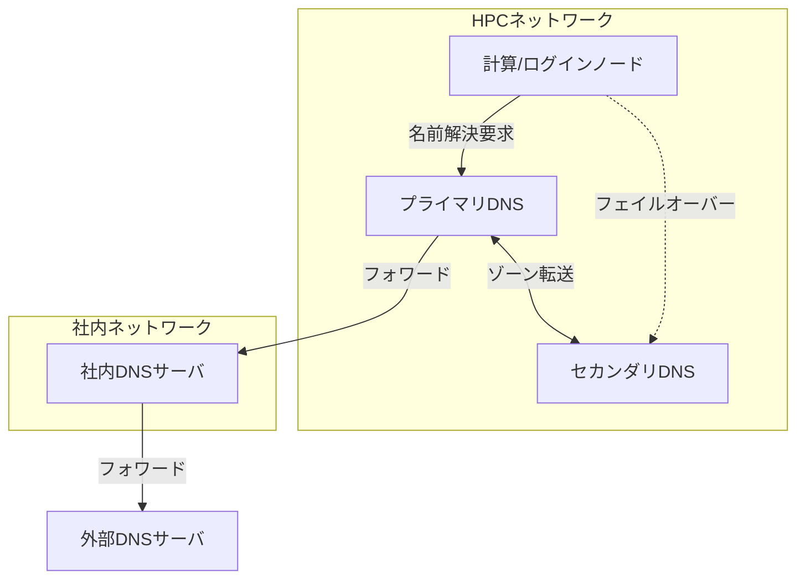
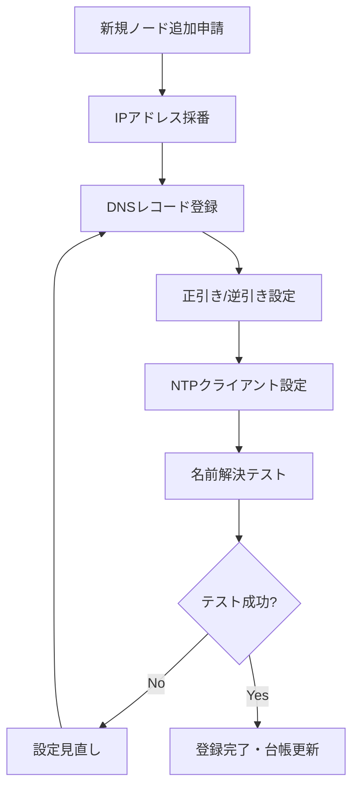

# DNS/NTPフォワーディング設定・ホスト登録

## 概要

本ページでは、HPCシステムにおけるDNSおよびNTPのフォワーディング設定と、ホスト登録の運用フローを記述する。

## DNS構成

### DNSサーバ基本情報

<!-- 実際のDNSサーバ情報を記載 -->

| 項目 | 内容 |
|---|---|
| DNSサーバソフトウェア | （要記入） |
| バージョン | （要記入） |
| プライマリDNS | （要記入） |
| セカンダリDNS | （要記入） |
| 管理ゾーン | （要記入） |

### フォワーディング設定

<!-- 実際のフォワーディング設定を記載 -->

| フォワード先 | 用途 | 条件 |
|---|---|---|
| （要記入） | 社内DNS | （要記入） |
| （要記入） | 外部DNS | （要記入） |

### DNS構成図

## NTP構成

### NTPサーバ基本情報

<!-- 実際のNTPサーバ情報を記載 -->

| 項目 | 内容 |
|---|---|
| NTPサーバソフトウェア | （要記入） |
| バージョン | （要記入） |
| NTPサーバ（プライマリ） | （要記入） |
| NTPサーバ（セカンダリ） | （要記入） |
| 上位NTPサーバ | （要記入） |

### NTP同期構成

<!-- 実際のNTP同期構成を記載 -->

| 同期元 | 同期先 | Stratum | 備考 |
|---|---|---|---|
| （要記入） | HPCプライマリNTP | （要記入） | （要記入） |
| HPCプライマリNTP | 計算ノード群 | （要記入） | （要記入） |
| HPCセカンダリNTP | 計算ノード群 | （要記入） | フェイルオーバー |

## ホスト登録運用フロー

### 新規ホスト登録フロー

### ホスト登録手順

1. （要記入）
2. （要記入）
3. （要記入）

## 運用手順

- DNSレコード追加/変更手順: （要記入）
- NTPサーバ設定変更手順: （要記入）
- DNS障害時の対応手順: （要記入）
- NTP同期異常時の対応手順: （要記入）

## 関連ページ

- [監視](monitoring.md)
- [ネットワーク論理構成](../network/logical-design.md)
- [IPアドレス管理](../network/ip-management.md)
