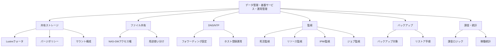

# データ管理・基盤サービス・運用管理

## 概要

本カテゴリでは、HPCシステムの基盤サービスおよび運用管理に関する構成情報を記述する。共有ストレージ（Lustre）のクォータ・パージポリシー、ファイル共有（NAS-GW）のアクセス権設定、DNS/NTPのフォワーディング設定、監視項目・通知設定、バックアップ運用、課金・統計集計をカバーする。

## 対象範囲

- 共有ストレージ（Lustre）のクォータ・パージポリシー・マウント構成
- ファイル共有（NAS-GW）のアクセス権設定・用途使い分け
- DNS/NTPフォワーディング設定・ホスト登録運用フロー
- 監視項目一覧・通知設定（死活監視、リソース監視、IPMI、ジョブ監視）
- バックアップ対象・頻度・リストア手順・サービス合意
- 課金ロジック・稼働統計集計方法

## カテゴリ構成図

## 各ページ一覧

| ページ | 概要 |
|---|---|
| [共有ストレージ](shared-storage.md) | Lustreファイルシステムのクォータ・パージポリシー・マウント構成 |
| [ファイル共有](nas-gw.md) | NAS-GWのアクセス権設定・用途使い分け |
| [DNS/NTP](dns-ntp.md) | DNS/NTPフォワーディング設定・ホスト登録運用フロー |
| [監視](monitoring.md) | 監視項目一覧・通知設定（死活・リソース・IPMI・ジョブ） |
| [バックアップ](backup.md) | バックアップ対象・頻度・リストア手順・サービス合意 |
| [課金・統計](billing.md) | 課金ロジック・稼働統計集計方法 |

## 関連ページ

- [計算リソース・ジョブ管理](../compute/index.md)
- [アプリケーション・ライセンス](../applications/index.md)
- [ネットワーク](../network/index.md)
