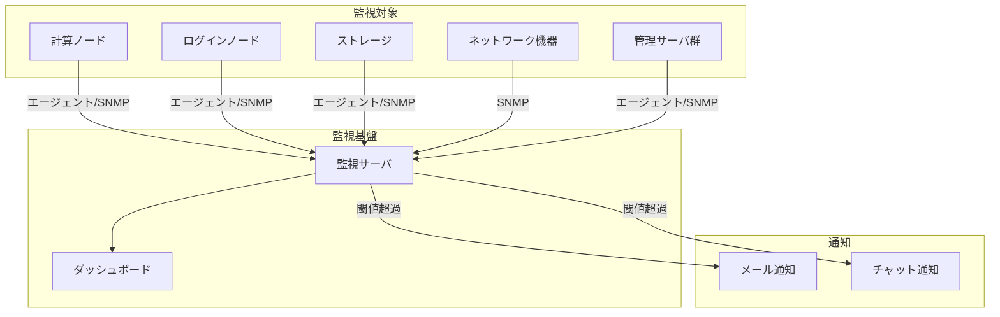
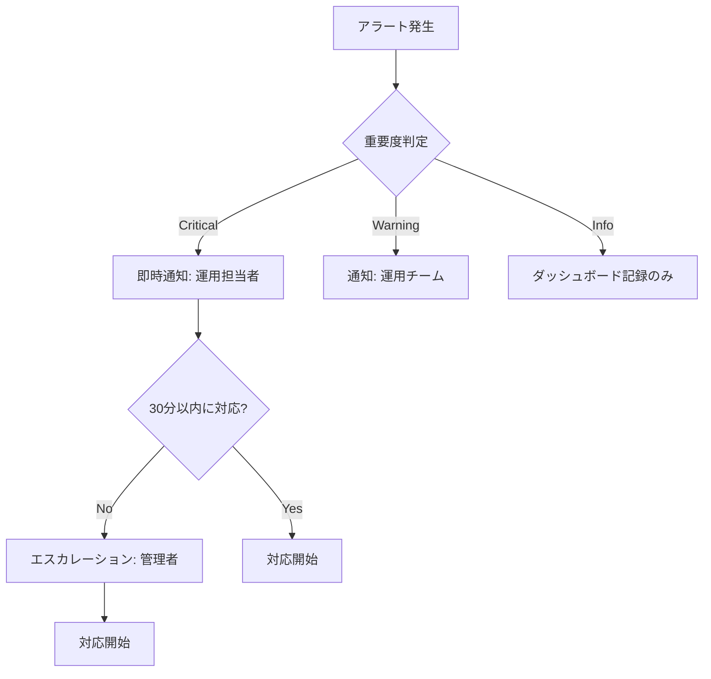

# 監視項目一覧・通知設定

## 概要

本ページでは、HPCシステムにおける監視項目の一覧と通知設定を記述する。死活監視、リソース監視、IPMI監視、ジョブ監視の各カテゴリについて、監視対象・閾値・通知先を定義する。

## 監視基盤情報

<!-- 実際の監視基盤情報を記載 -->

| 項目 | 内容 |
|---|---|
| 監視ソフトウェア | （要記入） |
| バージョン | （要記入） |
| 監視サーバ | （要記入） |
| ダッシュボードURL | （要記入） |
| データ保持期間 | （要記入） |

## 監視構成図

## 死活監視

<!-- 実際の死活監視項目を記載 -->

| 監視対象 | 監視方法 | 監視間隔 | 閾値 | 通知先 | 備考 |
|---|---|---|---|---|---|
| 計算ノード | （要記入） | （要記入） | （要記入） | （要記入） | （要記入） |
| ログインノード | （要記入） | （要記入） | （要記入） | （要記入） | （要記入） |
| ストレージ | （要記入） | （要記入） | （要記入） | （要記入） | （要記入） |
| ネットワーク機器 | （要記入） | （要記入） | （要記入） | （要記入） | （要記入） |
| 管理サーバ | （要記入） | （要記入） | （要記入） | （要記入） | （要記入） |

## リソース監視

<!-- 実際のリソース監視項目を記載 -->

| 監視対象 | 監視項目 | 閾値（Warning） | 閾値（Critical） | 通知先 |
|---|---|---|---|---|
| CPU使用率 | （要記入） | （要記入） | （要記入） | （要記入） |
| メモリ使用率 | （要記入） | （要記入） | （要記入） | （要記入） |
| ディスク使用率 | （要記入） | （要記入） | （要記入） | （要記入） |
| ネットワーク帯域 | （要記入） | （要記入） | （要記入） | （要記入） |
| ストレージ容量 | （要記入） | （要記入） | （要記入） | （要記入） |

## IPMI監視

<!-- 実際のIPMI監視項目を記載 -->

| 監視項目 | 監視対象 | 閾値 | 通知先 | 備考 |
|---|---|---|---|---|
| ハードウェア温度 | （要記入） | （要記入） | （要記入） | （要記入） |
| ファン回転数 | （要記入） | （要記入） | （要記入） | （要記入） |
| 電源ステータス | （要記入） | （要記入） | （要記入） | （要記入） |
| SELログ | （要記入） | （要記入） | （要記入） | （要記入） |

## ジョブ監視

<!-- 実際のジョブ監視項目を記載 -->

| 監視項目 | 監視方法 | 閾値 | 通知先 | 備考 |
|---|---|---|---|---|
| ジョブキュー滞留数 | （要記入） | （要記入） | （要記入） | （要記入） |
| ジョブ実行時間超過 | （要記入） | （要記入） | （要記入） | （要記入） |
| スケジューラプロセス | （要記入） | （要記入） | （要記入） | （要記入） |
| ノード利用率 | （要記入） | （要記入） | （要記入） | （要記入） |

## 通知設定

### 通知先一覧

<!-- 実際の通知先情報を記載 -->

| 通知先名 | 通知方法 | 宛先 | 対象アラート |
|---|---|---|---|
| （要記入） | メール | （要記入） | Critical |
| （要記入） | メール | （要記入） | Warning以上 |
| （要記入） | チャット | （要記入） | Critical |

### 通知エスカレーションフロー

## 運用手順

- 監視項目追加/変更手順: （要記入）
- 通知先変更手順: （要記入）
- 誤報対応手順: （要記入）
- 監視サーバ障害時の対応手順: （要記入）

## 関連ページ

- [共有ストレージ（Lustre）](shared-storage.md)
- [バックアップ](backup.md)
- [ジョブスケジューラ](../compute/scheduler.md)
