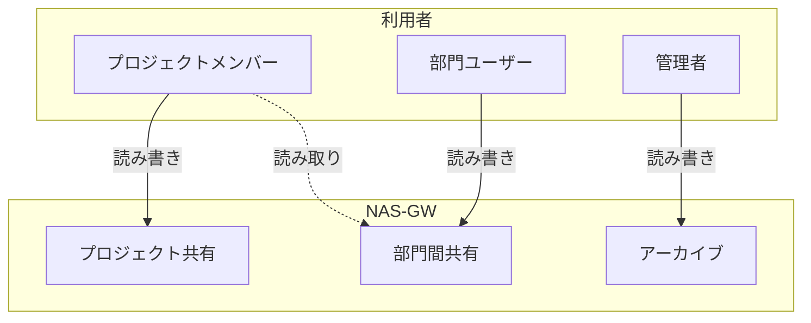

# ファイル共有（NAS-GW）

## 概要

本ページでは、HPCシステムにおけるファイル共有（NAS-GW）のアクセス権設定と用途使い分けを記述する。

## NAS-GW基本情報

<!-- 実際のNAS-GW情報を記載 -->

| 項目 | 内容 |
|---|---|
| 機器名/型番 | （要記入） |
| プロトコル | （要記入） |
| 総容量 | （要記入） |
| 冗長構成 | （要記入） |
| 接続ネットワーク | （要記入） |

## 共有構成

### 共有一覧

<!-- 実際の共有情報を記載 -->

| 共有名 | パス | 用途 | プロトコル | 対象ユーザー |
|---|---|---|---|---|
| （要記入） | （要記入） | プロジェクトデータ共有 | （要記入） | （要記入） |
| （要記入） | （要記入） | 部門間データ受け渡し | （要記入） | （要記入） |
| （要記入） | （要記入） | アーカイブ領域 | （要記入） | （要記入） |

### 用途使い分け

## アクセス権設定

### アクセス権ポリシー

<!-- 実際のアクセス権ポリシーを記載 -->

| 共有名 | 認証方式 | 読み取り権限 | 書き込み権限 | 管理者権限 |
|---|---|---|---|---|
| （要記入） | （要記入） | （要記入） | （要記入） | （要記入） |
| （要記入） | （要記入） | （要記入） | （要記入） | （要記入） |

### アクセス権設定手順

1. （要記入）
2. （要記入）
3. （要記入）

## Lustre共有ストレージとの使い分け

<!-- NAS-GWとLustreの使い分け基準を記載 -->

| 観点 | NAS-GW | Lustre共有ストレージ |
|---|---|---|
| 主な用途 | （要記入） | （要記入） |
| 性能特性 | （要記入） | （要記入） |
| 対象ユーザー | （要記入） | （要記入） |
| バックアップ | （要記入） | （要記入） |

## 運用手順

- 新規共有作成手順: （要記入）
- アクセス権変更手順: （要記入）
- 容量拡張手順: （要記入）
- 障害時の対応手順: （要記入）

## 関連ページ

- [共有ストレージ（Lustre）](shared-storage.md)
- [バックアップ](backup.md)
- [監視](monitoring.md)
