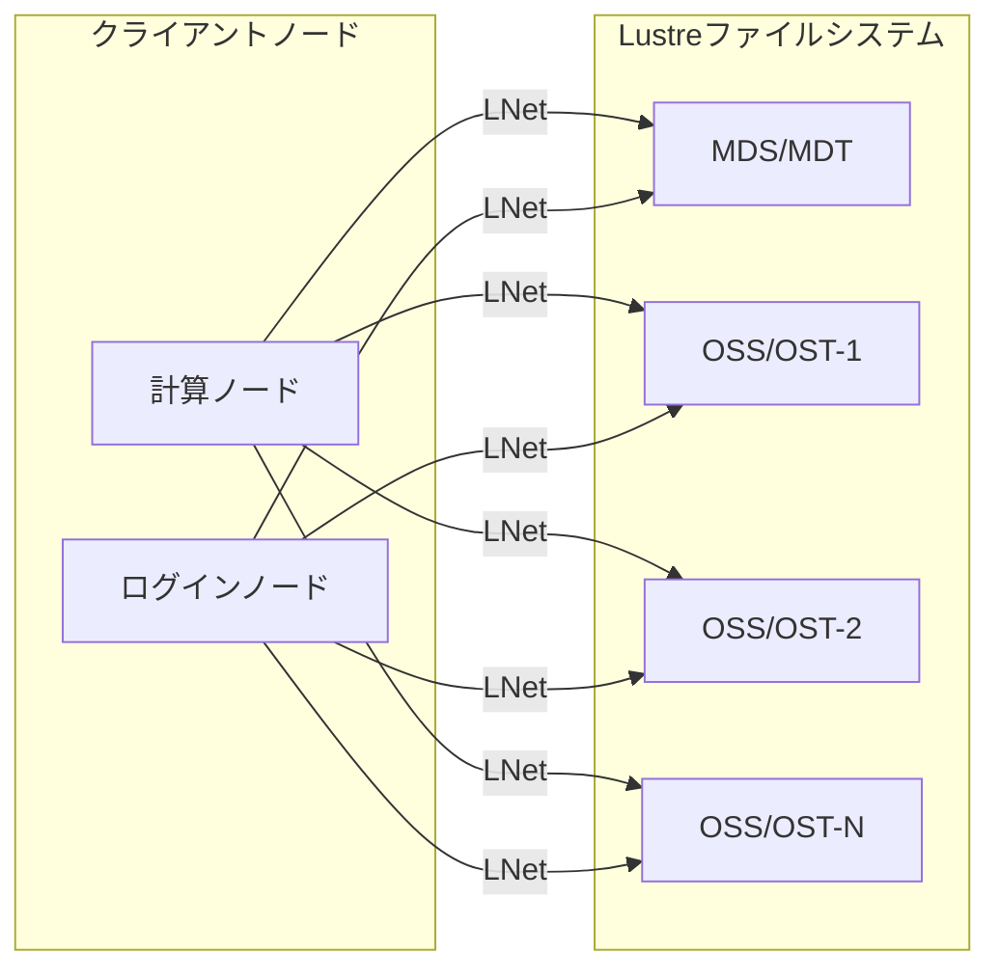
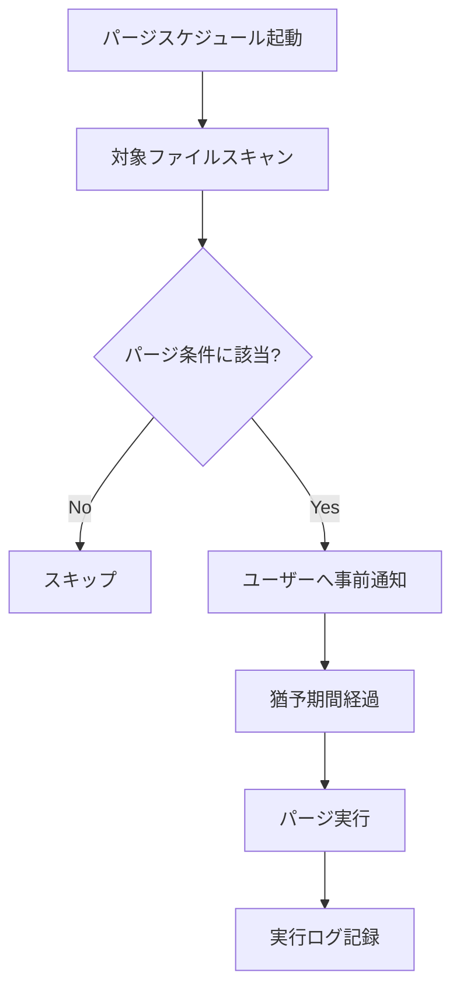

# 共有ストレージ（Lustre）

## 概要

本ページでは、HPCシステムの共有ストレージとして使用するLustreファイルシステムのクォータ設定、パージポリシー、およびマウント構成を記述する。

## ストレージ基本情報

<!-- 実際のストレージ情報を記載 -->

| 項目 | 内容 |
|---|---|
| ファイルシステム種別 | Lustre |
| バージョン | （要記入） |
| 総容量 | （要記入） |
| MDS構成 | （要記入） |
| OSS/OST構成 | （要記入） |
| ネットワーク接続 | （要記入） |

## マウント構成

### マウントポイント一覧

<!-- 実際のマウントポイント情報を記載 -->

| マウントポイント | 用途 | 対象ノード | マウントオプション |
|---|---|---|---|
| （要記入） | ホームディレクトリ | （要記入） | （要記入） |
| （要記入） | スクラッチ領域 | （要記入） | （要記入） |
| （要記入） | アプリケーション領域 | （要記入） | （要記入） |

### マウント構成図



## クォータ設定

### クォータポリシー

<!-- 実際のクォータポリシーを記載 -->

| 対象 | クォータ種別 | 制限値 | 備考 |
|---|---|---|---|
| ユーザー（ホーム） | 容量 | （要記入） | （要記入） |
| ユーザー（ホーム） | inode数 | （要記入） | （要記入） |
| ユーザー（スクラッチ） | 容量 | （要記入） | （要記入） |
| グループ | 容量 | （要記入） | （要記入） |

### クォータ確認コマンド

```bash
# ユーザークォータ確認
（要記入）

# グループクォータ確認
（要記入）
```

## パージポリシー

### パージ対象と条件

<!-- 実際のパージポリシーを記載 -->

| 対象領域 | パージ条件 | 保持期間 | 通知 |
|---|---|---|---|
| スクラッチ領域 | （要記入） | （要記入） | （要記入） |
| テンポラリ領域 | （要記入） | （要記入） | （要記入） |

### パージ実行フロー



## 運用手順

- クォータ変更手順: （要記入）
- パージポリシー変更手順: （要記入）
- ストレージ障害時の対応手順: （要記入）
- 容量逼迫時の対応手順: （要記入）

## 関連ページ

- [ファイル共有（NAS-GW）](nas-gw.md)
- [バックアップ](backup.md)
- [監視](monitoring.md)
