# HPC インフラ構成ドキュメント

## 概要

本サイトは、HPCシステムのインフラ構成を「機能・サービス視点」で可視化するドキュメントサイトである。システム運用者がHPCインフラの全体像を構造的に把握・管理するための情報基盤として機能する。

## サイト全体構成図

```mermaid
graph TD
    HOME["HPC インフラ構成ドキュメント"]
    HOME --> UA["ユーザーアクセス・認証・ポータル"]
    HOME --> CR["計算リソース・ジョブ管理"]
    HOME --> APP["アプリケーション・ライセンス"]
    HOME --> DO["データ管理・基盤サービス・運用管理"]
    HOME --> NW["ネットワーク"]
    HOME --> MAN["マニュアル・チュートリアル"]
    HOME --> FAQ["FAQ"]
    HOME --> ST["稼働状況"]

    UA --> UA1["ユーザー登録フロー"]
    UA --> UA2["ユーザー管理DB"]
    UA --> UA3["人事連携"]
    UA --> UA4["アカウント棚卸"]
    UA --> UA5["管理者権限"]
    UA --> UA6["UID/GIDポリシー"]
    UA --> UA7["アカウントライフサイクル"]
    UA --> UA8["LDAP/AD構成"]
    UA --> UA9["利用ポータル"]

    CR --> CR1["ノードタイプ"]
    CR --> CR2["仮想基盤"]
    CR --> CR3["キュー設計"]
    CR --> CR4["ジョブスケジューラ"]
    CR --> CR5["コンテナ"]

    APP --> APP1["CAEソフトウェア"]
    APP --> APP2["ライセンスサーバ"]
    APP --> APP3["GitHub Server"]

    DO --> DO1["共有ストレージ"]
    DO --> DO2["ファイル共有"]
    DO --> DO3["DNS/NTP"]
    DO --> DO4["監視"]
    DO --> DO5["バックアップ"]
    DO --> DO6["課金・統計"]

    NW --> NW1["論理構成"]
    NW --> NW2["VLAN/サブネット"]
    NW --> NW3["IPアドレス管理"]
```

## カテゴリ一覧

### ユーザーアクセス・認証・ポータル

ユーザー管理・認証基盤・利用ポータルの構成情報。アカウント管理、LDAP/AD構成、ポータル機能をカバーする。

:material-arrow-right: [ユーザーアクセス・認証・ポータル](user-access/index.md)

### 計算リソース・ジョブ管理

計算リソースの構成とジョブ管理の設計情報。ノードタイプ、キュー設計、スケジューラ、コンテナ利用をカバーする。

:material-arrow-right: [計算リソース・ジョブ管理](compute/index.md)

### アプリケーション・ライセンス

CAEソフトウェアやライセンスサーバの構成情報。バージョン管理、ライセンスポリシー、GitHub Server運用をカバーする。

:material-arrow-right: [アプリケーション・ライセンス](applications/index.md)

### データ管理・基盤サービス・運用管理

ストレージ・DNS・監視・バックアップ等の基盤サービス構成。日常運用と障害対応に必要な情報をカバーする。

:material-arrow-right: [データ管理・基盤サービス・運用管理](data-ops/index.md)

### ネットワーク

HPCネットワークの論理構成とアドレス管理情報。VLAN/サブネット構成、IPアドレス管理をカバーする。

:material-arrow-right: [ネットワーク](network/index.md)

### 補助コンテンツ

- [マニュアル・チュートリアル](manuals/index.md) — 利用手順書・チュートリアル
- [FAQ](faq/index.md) — よくある質問と回答
- [稼働状況](status/index.md) — システム稼働状況の公開情報
