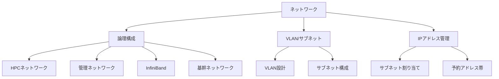

# ネットワーク

## 概要

本カテゴリでは、HPCシステムにおけるネットワークの論理構成とアドレス管理情報を記述する。HPC/管理/InfiniBand/基幹ネットワークの役割と論理構成、サブネットおよびVLAN構成、IPアドレス管理情報をカバーする。

## 対象範囲

- HPC/管理/InfiniBand/基幹ネットワークの役割と論理構成
- サブネットおよびVLAN構成図
- IPアドレス管理情報（サブネット割り当て、予約アドレス帯）

## カテゴリ構成図

## 各ページ一覧

| ページ | 概要 |
|---|---|
| [論理構成](logical-design.md) | HPC/管理/InfiniBand/基幹ネットワークの役割と論理構成 |
| [VLAN/サブネット](vlan-subnet.md) | サブネットおよびVLAN構成図（Mermaid記法） |
| [IPアドレス管理](ip-management.md) | IPアドレス管理情報（サブネット割り当て、予約アドレス帯） |

## 関連ページ

- [計算リソース・ジョブ管理](../compute/index.md)
- [データ管理・基盤サービス・運用管理](../data-ops/index.md)
- [ユーザーアクセス・認証・ポータル](../user-access/index.md)
