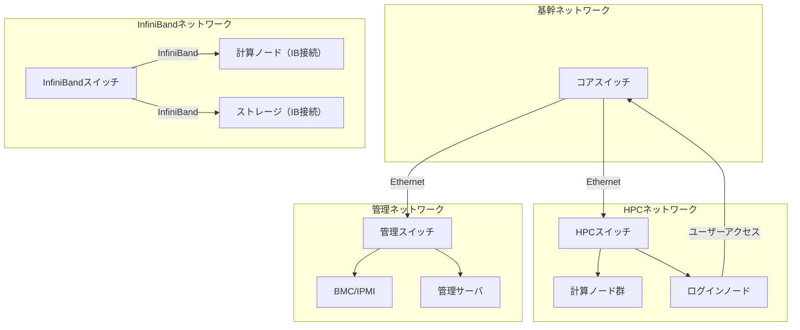

# ネットワーク論理構成

## 概要

本ページでは、HPCシステムにおける各ネットワークセグメントの役割と論理構成を記述する。

## ネットワークセグメント一覧

| セグメント名 | 役割 | 主な接続対象 | 備考 |
|---|---|---|---|
| HPCネットワーク | （要記入） | （要記入） | （要記入） |
| 管理ネットワーク | （要記入） | （要記入） | （要記入） |
| InfiniBand | （要記入） | （要記入） | （要記入） |
| 基幹ネットワーク | （要記入） | （要記入） | （要記入） |

## 各ネットワークの役割

### HPCネットワーク

<!-- 実際のHPCネットワーク情報を記載 -->

- 用途: （要記入）
- 帯域: （要記入）
- 接続機器: （要記入）

### 管理ネットワーク

<!-- 実際の管理ネットワーク情報を記載 -->

- 用途: （要記入）
- 帯域: （要記入）
- 接続機器: （要記入）

### InfiniBand

<!-- 実際のInfiniBand情報を記載 -->

- 用途: （要記入）
- 帯域: （要記入）
- 接続機器: （要記入）
- トポロジ: （要記入）

### 基幹ネットワーク

<!-- 実際の基幹ネットワーク情報を記載 -->

- 用途: （要記入）
- 帯域: （要記入）
- 接続機器: （要記入）

## 論理トポロジ構成図

## スイッチ構成

<!-- 実際のスイッチ構成情報を記載 -->

| スイッチ名 | 機種 | ポート数 | 設置場所 | 備考 |
|---|---|---|---|---|
| （要記入） | （要記入） | （要記入） | （要記入） | （要記入） |
| （要記入） | （要記入） | （要記入） | （要記入） | （要記入） |
| （要記入） | （要記入） | （要記入） | （要記入） | （要記入） |

## 運用手順

- ネットワーク構成変更手順: （要記入）
- スイッチ障害時の対応手順: （要記入）
- InfiniBand障害時の対応手順: （要記入）

## 関連ページ

- [VLAN/サブネット](vlan-subnet.md)
- [IPアドレス管理](ip-management.md)
- [DNS/NTP](../data-ops/dns-ntp.md)
- [監視](../data-ops/monitoring.md)
