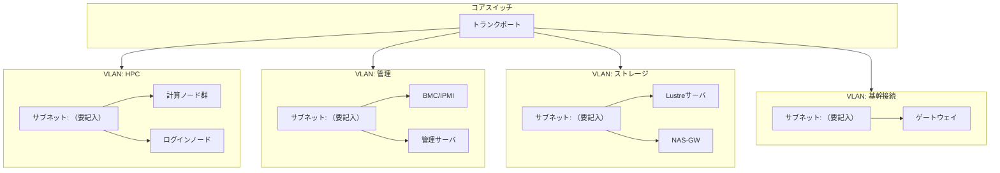

# VLAN/サブネット構成

## 概要

本ページでは、HPCシステムにおけるVLAN設計とサブネット構成を記述する。各VLANの用途、割り当てサブネット、およびVLAN間の関係を構成図とともに示す。

## VLAN一覧

<!-- 実際のVLAN情報を記載 -->

| VLAN ID | VLAN名 | 用途 | サブネット | 備考 |
|---|---|---|---|---|
| （要記入） | （要記入） | HPCネットワーク | （要記入） | （要記入） |
| （要記入） | （要記入） | 管理ネットワーク | （要記入） | （要記入） |
| （要記入） | （要記入） | InfiniBand管理 | （要記入） | （要記入） |
| （要記入） | （要記入） | 基幹接続 | （要記入） | （要記入） |
| （要記入） | （要記入） | ストレージ | （要記入） | （要記入） |

## サブネット構成

<!-- 実際のサブネット情報を記載 -->

| サブネット | CIDR | VLAN | 用途 | ゲートウェイ |
|---|---|---|---|---|
| （要記入） | （要記入） | （要記入） | （要記入） | （要記入） |
| （要記入） | （要記入） | （要記入） | （要記入） | （要記入） |
| （要記入） | （要記入） | （要記入） | （要記入） | （要記入） |

## VLAN/サブネット構成図

## VLAN間ルーティング

<!-- 実際のルーティング情報を記載 -->

| 送信元VLAN | 宛先VLAN | 許可/拒否 | 備考 |
|---|---|---|---|
| （要記入） | （要記入） | （要記入） | （要記入） |
| （要記入） | （要記入） | （要記入） | （要記入） |
| （要記入） | （要記入） | （要記入） | （要記入） |

## 運用手順

- VLAN追加/変更手順: （要記入）
- サブネット追加手順: （要記入）
- VLAN間通信トラブルシューティング: （要記入）

## 関連ページ

- [論理構成](logical-design.md)
- [IPアドレス管理](ip-management.md)
- [DNS/NTP](../data-ops/dns-ntp.md)
