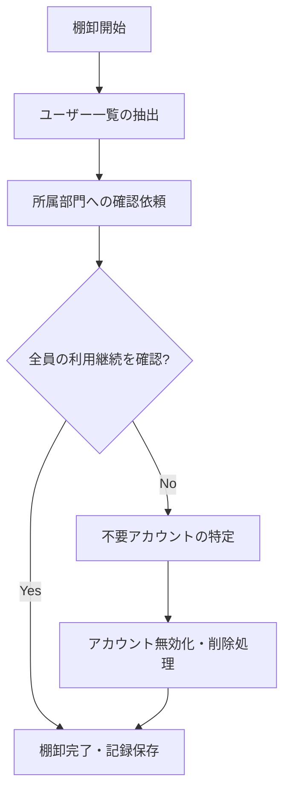

# ユーザー定期棚卸方法

## 概要

本ページでは、HPCシステムに登録されているユーザーアカウントの定期棚卸（監査）の方法と手順を記述する。不要アカウントの検出・整理を通じてセキュリティを維持する。

## 棚卸フロー

## 棚卸スケジュール

| 項目 | 内容 |
|---|---|
| 実施頻度 | （要記入：例 年2回、四半期ごと等） |
| 実施時期 | （要記入） |
| 担当者 | （要記入） |
| 報告先 | （要記入） |

## チェック項目

- [ ] 全登録ユーザーの在籍確認
- [ ] 長期未ログインアカウントの検出
- [ ] 退職者アカウントの残存確認
- [ ] 権限設定の妥当性確認
- [ ] グループ所属の妥当性確認

## 運用手順

1. ユーザー管理DBからアカウント一覧を抽出する
2. 最終ログイン日時を確認し、長期未使用アカウントを特定する
3. 各部門の管理者に利用継続の確認を依頼する
4. 不要と判断されたアカウントをロック・削除する
5. 棚卸結果を記録・報告する

## 関連ページ

- [ユーザー管理DB](user-db.md)
- [アカウントライフサイクル](account-lifecycle.md)
- [人事連携](hr-sync.md)
