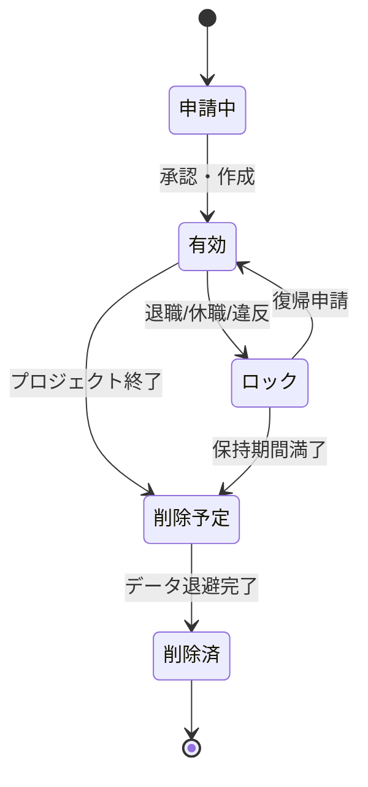

# アカウントロック・削除手順

## 概要

本ページでは、退職・プロジェクト終了・セキュリティインシデント等に伴うアカウントのロック（無効化）および削除の手順を記述する。データ保全方針も含む。

## アカウントライフサイクル

## アカウントロック手順

### ロック対象条件

| 条件 | 対応 | 猶予期間 |
|---|---|---|
| 退職 | 即時ロック | （要記入） |
| 休職 | ロック | （要記入） |
| 長期未使用 | 通知後ロック | （要記入） |
| セキュリティ違反 | 即時ロック | なし |

### ロック実施手順

1. ロック対象アカウントの確認
2. 実行中ジョブの確認・対処
3. アカウントロックの実行（LDAP/AD、ユーザー管理DB）
4. SSH鍵の無効化
5. ロック実施の記録

## アカウント削除手順

### 削除前チェックリスト

- [ ] 実行中ジョブがないことを確認
- [ ] ホームディレクトリのデータ退避
- [ ] 共有データの所有権移管
- [ ] 関連サービスのアカウント削除

### 削除実施手順

1. データ退避・所有権移管の完了確認
2. LDAP/ADからのアカウント削除
3. ユーザー管理DBからのレコード削除（または無効化フラグ設定）
4. ホームディレクトリの削除（保持期間経過後）
5. 削除実施の記録

## データ保全方針

<!-- データ保持期間、退避先、退避方法を記載 -->

| 項目 | 方針 |
|---|---|
| データ保持期間 | （要記入） |
| 退避先 | （要記入） |
| 退避方法 | （要記入） |

## 運用手順

- 定期的なロック対象アカウントの確認
- 削除スケジュールの管理
- データ退避の実施と確認

## 関連ページ

- [ユーザー登録フロー](registration-flow.md)
- [人事連携](hr-sync.md)
- [アカウント棚卸](account-audit.md)
