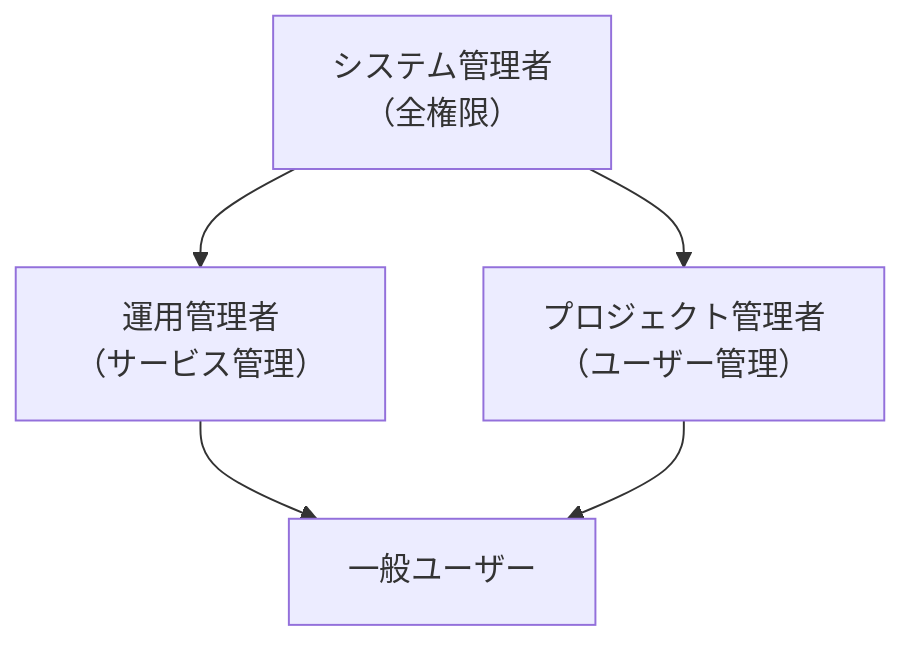

# 管理者権限の割り当て方針

## 概要

本ページでは、HPCシステムにおけるシステム管理者権限（root、sudo等）の割り当て方針と運用ルールを記述する。最小権限の原則に基づく権限設計を定義する。

## 権限レベル定義

| 権限レベル | 対象者 | 権限範囲 | 備考 |
|---|---|---|---|
| システム管理者 | （要記入） | 全システムへのroot権限 | （要記入） |
| 運用管理者 | （要記入） | 特定サービスの管理権限 | （要記入） |
| プロジェクト管理者 | （要記入） | プロジェクト内のユーザー管理 | （要記入） |
| 一般ユーザー | 全利用者 | ジョブ投入・データアクセス | （要記入） |

## 権限構成図

## 割り当て方針

### 基本方針

- 最小権限の原則: 業務に必要な最小限の権限のみを付与する
- 権限の分離: 管理権限は役割に応じて分離する
- 定期見直し: 権限の妥当性を定期的に確認する

### 権限申請・承認プロセス

<!-- 権限申請の手順、承認者、承認基準を記載 -->

1. 権限申請書の提出: （要記入）
2. 承認者による審査: （要記入）
3. 権限付与の実施: （要記入）
4. 付与記録の保存: （要記入）

## sudo設定

<!-- sudoersファイルの設定方針、許可コマンドの範囲等を記載 -->

- sudoers管理方式: （要記入）
- 許可コマンド範囲: （要記入）
- ログ記録: （要記入）

## 運用手順

- 権限付与手順: （要記入）
- 権限剥奪手順: （要記入）
- 定期監査手順: （要記入）

## 関連ページ

- [UID/GIDポリシー](uid-gid-policy.md)
- [アカウント棚卸](account-audit.md)
- [LDAP/AD構成](ldap-ad.md)
