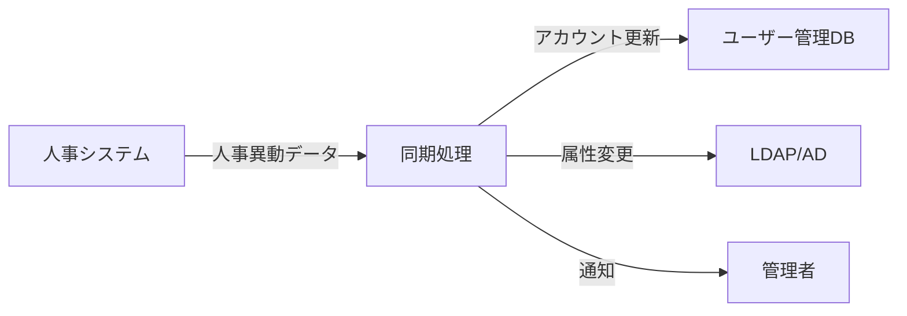

# 人事・組織変更との同期連携

## 概要

本ページでは、人事システムとHPCユーザー管理システム間の同期連携について記述する。退職・部署移動・組織改編時のアカウント情報の自動連携状況を含む。

## 連携構成図

## 連携対象イベント

| イベント | 連携内容 | 自動/手動 | 備考 |
|---|---|---|---|
| 新規入社 | アカウント作成依頼 | （要記入） | （要記入） |
| 部署異動 | 所属グループ変更 | （要記入） | （要記入） |
| 退職 | アカウント無効化 | （要記入） | （要記入） |
| 組織改編 | グループ構成変更 | （要記入） | （要記入） |
| 休職 | アカウント一時停止 | （要記入） | （要記入） |

## 同期方式

<!-- 同期方式の詳細（バッチ処理、API連携、手動対応等）を記載 -->

- 連携方式: （要記入）
- 同期頻度: （要記入）
- 同期元データ形式: （要記入）
- エラーハンドリング: （要記入）

## 運用手順

1. 人事異動情報の受領確認
2. 同期処理の実行（自動/手動）
3. 同期結果の確認
4. エラー発生時の対処

## 関連ページ

- [ユーザー管理DB](user-db.md)
- [アカウントライフサイクル](account-lifecycle.md)
- [アカウント棚卸](account-audit.md)
