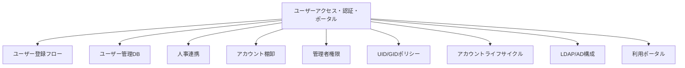

# ユーザーアクセス・認証・ポータル

## 概要

本カテゴリでは、HPCシステムにおけるユーザーアカウント管理、認証基盤、利用ポータルに関する構成情報を記述する。ユーザーの登録から退職・プロジェクト終了時の削除まで、アカウントライフサイクル全体をカバーする。

## 対象範囲

- ユーザー登録・承認フロー
- ユーザー管理データベース
- 人事・組織変更との連携
- アカウント棚卸・監査
- 管理者権限の運用方針
- UID/GID採番ルール
- アカウントロック・削除手順
- LDAP/AD認証基盤
- 利用ポータル機能

## カテゴリ構成図

## 各ページ一覧

| ページ | 概要 |
|---|---|
| [ユーザー登録フロー](registration-flow.md) | 申請から承認・アカウント作成までのフロー |
| [ユーザー管理DB](user-db.md) | 複数DBの構成と連携状況 |
| [人事連携](hr-sync.md) | 人事・組織変更との同期連携 |
| [アカウント棚卸](account-audit.md) | 定期棚卸の方法と手順 |
| [管理者権限](admin-privileges.md) | 管理者権限の割り当て方針 |
| [UID/GIDポリシー](uid-gid-policy.md) | UID/GID採番ルールとグループポリシー |
| [アカウントライフサイクル](account-lifecycle.md) | アカウントロック・削除手順 |
| [LDAP/AD構成](ldap-ad.md) | LDAP/AD参照構成と認証情報同期 |
| [利用ポータル](portal.md) | ポータル機能一覧・SSH接続・API連携 |

## 関連ページ

- [計算リソース・ジョブ管理](../compute/index.md)
- [ネットワーク](../network/index.md)
