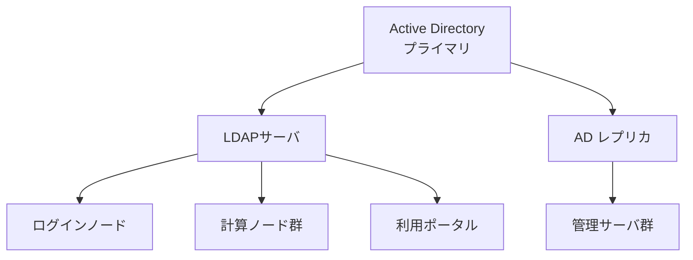

# LDAP/AD参照構成と認証情報同期

## 概要

本ページでは、HPCシステムの認証基盤であるLDAP/Active Directoryの参照構成、ディレクトリツリー構成、および計算ノードへの認証情報同期方式を記述する。

## LDAP/AD構成図



## ディレクトリツリー構成

<!-- 実際のDN構成を記載 -->

```
dc=example,dc=local
├── ou=Users
│   ├── ou=Department_A
│   └── ou=Department_B
├── ou=Groups
│   ├── ou=Project_Groups
│   └── ou=System_Groups
├── ou=ServiceAccounts
└── ou=Computers
```

| 項目 | 設定値 |
|---|---|
| ベースDN | （要記入） |
| ユーザーOU | （要記入） |
| グループOU | （要記入） |
| バインドアカウント | （要記入） |

## 認証情報同期方式

### 計算ノードへの同期

<!-- SSSD、nscd、nslcd等の同期方式を記載 -->

| 項目 | 内容 |
|---|---|
| 同期方式 | （要記入：例 SSSD, nscd等） |
| キャッシュ設定 | （要記入） |
| 同期間隔 | （要記入） |
| フェイルオーバー | （要記入） |

### パスワードポリシー

| 項目 | 設定値 |
|---|---|
| 最小文字数 | （要記入） |
| 有効期限 | （要記入） |
| 複雑性要件 | （要記入） |
| ロックアウト閾値 | （要記入） |

## 運用手順

- LDAPサーバの監視項目: （要記入）
- レプリケーション状態の確認: （要記入）
- 障害時のフェイルオーバー手順: （要記入）
- 証明書更新手順: （要記入）

## 関連ページ

- [ユーザー登録フロー](registration-flow.md)
- [ユーザー管理DB](user-db.md)
- [UID/GIDポリシー](uid-gid-policy.md)
- [利用ポータル](portal.md)
