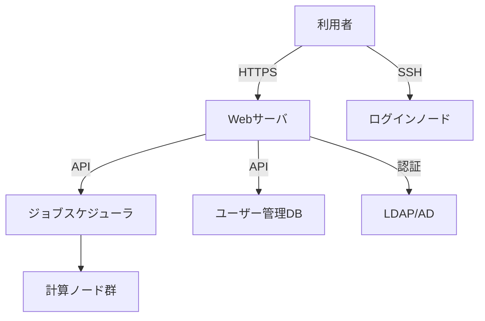

# 利用ポータル機能一覧

## 概要

本ページでは、HPCシステムの利用ポータルが提供するWeb画面機能一覧、SSH接続方法、ポータル保守手順、およびバックエンドのWebサーバーとスケジューラ/DB連携APIについて記述する。

## ポータル構成図

## Web画面機能一覧

| 機能 | 概要 | 対象ユーザー |
|---|---|---|
| ダッシュボード | ジョブ状況・リソース使用状況の概要表示 | 全ユーザー |
| ジョブ投入 | Webフォームからのジョブ投入 | 全ユーザー |
| ジョブ管理 | 実行中・完了ジョブの一覧・詳細表示 | 全ユーザー |
| ファイル管理 | ホームディレクトリのファイル操作 | 全ユーザー |
| アカウント設定 | パスワード変更・SSH鍵登録 | 全ユーザー |
| 管理機能 | ユーザー管理・システム設定 | 管理者 |

## SSH接続方法

### 接続情報

| 項目 | 内容 |
|---|---|
| ホスト名 | （要記入） |
| ポート | （要記入） |
| 認証方式 | （要記入：例 公開鍵認証、パスワード認証） |
| 踏み台サーバ | （要記入） |

### 接続手順

1. SSH鍵ペアの生成（未作成の場合）
2. ポータルで公開鍵を登録
3. SSHクライアントで接続

## ジョブ投入ユースケース

<!-- 代表的なジョブ投入パターンを記載 -->

### ユースケース1: バッチジョブ投入

- 投入方法: （要記入）
- スクリプト例: （要記入）

### ユースケース2: インタラクティブジョブ

- 投入方法: （要記入）
- 利用シーン: （要記入）

## バックエンドAPI連携

### Webサーバ構成

| 項目 | 内容 |
|---|---|
| Webサーバ | （要記入） |
| アプリケーションフレームワーク | （要記入） |
| 動作環境 | （要記入） |

### スケジューラ連携API

| エンドポイント | メソッド | 機能 |
|---|---|---|
| （要記入） | （要記入） | ジョブ投入 |
| （要記入） | （要記入） | ジョブ状態取得 |
| （要記入） | （要記入） | ジョブキャンセル |

### DB連携API

| エンドポイント | メソッド | 機能 |
|---|---|---|
| （要記入） | （要記入） | ユーザー情報取得 |
| （要記入） | （要記入） | 利用実績取得 |

### ログ出力先

| ログ種別 | 出力先 | ローテーション |
|---|---|---|
| アクセスログ | （要記入） | （要記入） |
| アプリケーションログ | （要記入） | （要記入） |
| エラーログ | （要記入） | （要記入） |

## ポータル保守手順

- サービス起動・停止手順: （要記入）
- ログ確認手順: （要記入）
- SSL証明書更新手順: （要記入）
- バックアップ・リストア手順: （要記入）

## 関連ページ

- [ユーザー登録フロー](registration-flow.md)
- [LDAP/AD構成](ldap-ad.md)
- [ユーザー管理DB](user-db.md)
