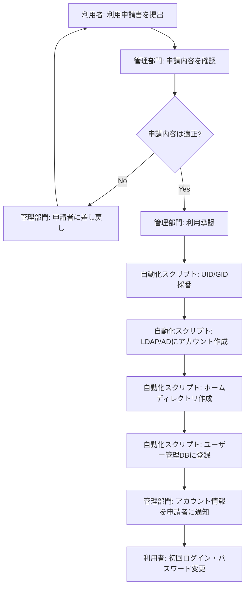
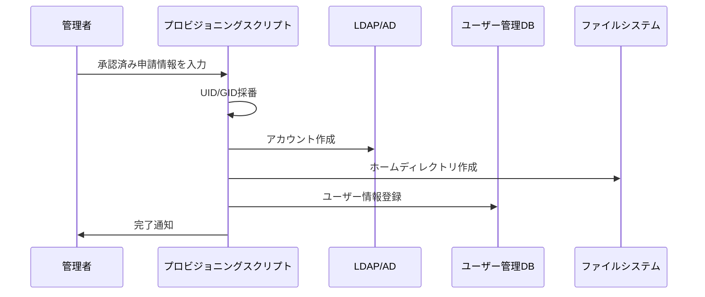

# ユーザー登録フロー

## 概要

本ページでは、HPCシステムの新規ユーザー登録における申請・承認・アカウント作成の一連のフローを記述する。自動化スクリプトによるアカウントプロビジョニングの仕様も含む。

## 登録フロー全体図

## 申請手順

### 利用申請書の提出

<!-- 実際の申請方法（Webフォーム、メール、紙面等）を記載 -->

- 申請方法: （要記入）
- 申請に必要な情報: 氏名、所属部署、利用目的、希望利用期間、所属プロジェクト
- 申請先: （要記入）

### 承認プロセス

<!-- 承認者、承認基準、承認期間等を記載 -->

- 承認者: （要記入）
- 承認基準: （要記入）
- 標準承認期間: （要記入）

## 自動化スクリプト仕様

### アカウントプロビジョニングスクリプト

| 項目 | 内容 |
|---|---|
| スクリプト名 | （要記入） |
| 実行環境 | （要記入） |
| 入力パラメータ | ユーザー名、所属、プロジェクト等 |
| 処理内容 | UID/GID採番 → LDAP登録 → ホームディレクトリ作成 → DB登録 |
| ログ出力先 | （要記入） |

## 運用手順

1. 利用申請書を受領し、内容を確認する
2. 承認後、プロビジョニングスクリプトを実行する
3. アカウント情報を申請者に通知する
4. 初回ログイン・パスワード変更を確認する

## 関連ページ

- [ユーザー管理DB](user-db.md)
- [UID/GIDポリシー](uid-gid-policy.md)
- [LDAP/AD構成](ldap-ad.md)
- [アカウントライフサイクル](account-lifecycle.md)
