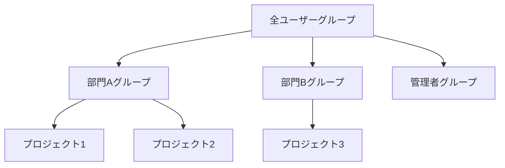

# UID/GID採番ルールとグループポリシー

## 概要

本ページでは、HPCシステムにおけるUID（ユーザーID）およびGID（グループID）の採番ルールとグループ所属ポリシーを記述する。全システムで一貫したID管理を実現するための規則を定義する。

## UID採番ルール

| 範囲 | 用途 | 備考 |
|---|---|---|
| 0–999 | システムアカウント | OS予約領域 |
| 1000–9999 | （要記入） | （要記入） |
| 10000–19999 | （要記入） | （要記入） |
| 20000–29999 | （要記入） | （要記入） |

## GID採番ルール

| 範囲 | 用途 | 備考 |
|---|---|---|
| 0–999 | システムグループ | OS予約領域 |
| 1000–9999 | （要記入） | （要記入） |
| 10000–19999 | （要記入） | （要記入） |

## グループ構成図

## グループ所属ポリシー

### プライマリグループ

- 採番方式: （要記入）
- 命名規則: （要記入）

### セカンダリグループ

- 所属ルール: （要記入）
- 最大所属数: （要記入）

### プロジェクトグループ

- 作成基準: （要記入）
- 命名規則: （要記入）
- 有効期限: （要記入）

## 運用手順

- 新規UID/GID採番手順: （要記入）
- グループ作成手順: （要記入）
- グループメンバー変更手順: （要記入）

## 関連ページ

- [ユーザー登録フロー](registration-flow.md)
- [管理者権限](admin-privileges.md)
- [LDAP/AD構成](ldap-ad.md)
