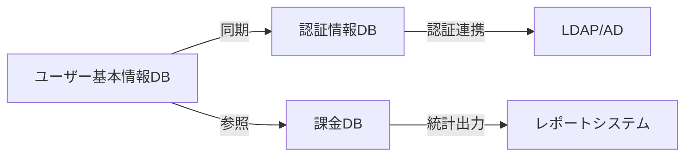

# ユーザー管理DB一覧

## 概要

本ページでは、HPCシステムで運用されている複数のユーザー管理データベースの一覧、各DBの役割・独立性、およびDB間のデータ連携状況を記述する。

## DB一覧

<!-- 実際のDB情報を記載 -->

| DB名 | 用途 | 管理サーバ | 連携先 |
|---|---|---|---|
| （要記入） | ユーザー基本情報管理 | （要記入） | （要記入） |
| （要記入） | 認証情報管理 | （要記入） | （要記入） |
| （要記入） | 課金・利用実績管理 | （要記入） | （要記入） |

## DB間連携構成図

## 各DBの独立性

<!-- 各DBの独立性（単独運用可否、障害時の影響範囲等）を記載 -->

### DB1: （DB名を記入）

- 独立性: （要記入）
- 障害時の影響範囲: （要記入）
- バックアップ方式: （要記入）

### DB2: （DB名を記入）

- 独立性: （要記入）
- 障害時の影響範囲: （要記入）
- バックアップ方式: （要記入）

## データ連携状況

<!-- 連携方式（バッチ、リアルタイム等）、連携頻度、連携エラー時の対処を記載 -->

| 連携元 | 連携先 | 連携方式 | 頻度 | エラー時対処 |
|---|---|---|---|---|
| （要記入） | （要記入） | （要記入） | （要記入） | （要記入） |

## 運用手順

- DB定期メンテナンス手順: （要記入）
- データ整合性チェック手順: （要記入）
- 障害復旧手順: （要記入）

## 関連ページ

- [ユーザー登録フロー](registration-flow.md)
- [人事連携](hr-sync.md)
- [LDAP/AD構成](ldap-ad.md)
